# Claude Code Agentic Software Development System

A comprehensive agentic software development system that integrates **Canon Test-Driven Development (TDD)** principles with specialized AI agents for systematic, high-quality software development.

## Overview

This repository contains an orchestrated workflow system where **Orchestrator Claude** analyzes incoming tasks and delegates them sequentially to specialized sub-agents following established workflows enhanced with Canon TDD principles as defined by Kent Beck.

## Canon TDD Integration

The system emphasizes Kent Beck's Canon TDD approach:

- ✅ Creating a test list first, then iteratively writing tests
- ✅ Red-Green-Refactor cycles: Write failing test → Make it pass → Improve design  
- ✅ Building confidence through systematic testing
- ✅ No faking assertions, constants, or deletion of code
- ✅ Adding discoveries to the test list during implementation

### Canon TDD Cycle

```mermaid
graph LR
    subgraph "Canon TDD Workflow"
        TL[Create Test List]
        WT[Write Test]
        RED[🔴 Red: Test Fails]
        GREEN[🟢 Green: Make Test Pass]
        REFACTOR[🔵 Refactor: Improve Design]
        ADD[Add Discovery to Test List]
    end
    
    TL --> WT
    WT --> RED
    RED --> GREEN
    GREEN --> REFACTOR
    REFACTOR --> WT
    GREEN --> ADD
    REFACTOR --> ADD
    ADD --> WT
    
    style RED fill:#ffcccc
    style GREEN fill:#ccffcc
    style REFACTOR fill:#ccccff
    style TL fill:#ffffcc
    style ADD fill:#ffccff
```

## System Architecture

### Complete Workflow Diagram

### System Architecture Overview

### Agent Coordination

Each agent saves outputs to the **ai_docs/** directory for seamless handoffs:
- `requirements.md` - Requirements and user stories
- `architecture.md` - System design and tech stack
- `database-design.md` - Schema and optimization
- `security-design.md` - Security architecture and controls
- `ui-design.md` - Design system and prototypes
- `test-scenarios.md` - Comprehensive test list for TDD
- `implementation-progress.md` - Development progress and TDD cycles
- And more specialized documentation files

### Data Flow Between Agents

## Available Specialists

### Core Development
- **[Requirements Analyst](/.claude/agents/requirements-analyst.md)** - Gathers and analyzes project requirements
- **[Software Architect](/.claude/agents/software-architect.md)** - Designs system architecture and tech stack decisions
- **[Lead Developer](/.claude/agents/lead-developer.md)** - Coordinates TDD cycles and core implementation
- **[Frontend Specialist](/.claude/agents/frontend-specialist.md)** - UI implementation with TDD cycles
- **[Backend Specialist](/.claude/agents/backend-specialist.md)** - Server-side implementation with TDD cycles

### Domain & Design
- **[Domain Expert](/.claude/agents/domain-expert.md)** - Incorporates industry-specific knowledge
- **[UX Specialist](/.claude/agents/ux-specialist.md)** - Defines user experience requirements
- **[UI/UX Designer](/.claude/agents/ui-ux-designer.md)** - Creates design systems and prototypes

### Data & Security
- **[Database Specialist](/.claude/agents/database-specialist.md)** - Database design and optimization
- **[Security Specialist](/.claude/agents/security-specialist.md)** - Security architecture and controls
- **[Security Tester](/.claude/agents/security-tester.md)** - Penetration testing and vulnerability assessment

### Testing & Quality
- **[Test Planner](/.claude/agents/test-planner.md)** - Creates comprehensive test scenarios for TDD
- **[QA Tester](/.claude/agents/qa-tester.md)** - Manual and automated test case development
- **[Automation Tester](/.claude/agents/automation-tester.md)** - Test automation framework implementation
- **[Performance Tester](/.claude/agents/performance-tester.md)** - Load testing and performance validation
- **[Code Reviewer](/.claude/agents/code-reviewer.md)** - Peer review and TDD compliance verification

### Operations & Infrastructure
- **[DevOps Engineer](/.claude/agents/devops-engineer.md)** - CI/CD pipeline setup and automation
- **[Deployment Engineer](/.claude/agents/deployment-engineer.md)** - Production deployment strategies
- **[Operations Specialist](/.claude/agents/operations-specialist.md)** - System monitoring and maintenance
- **[Performance Optimizer](/.claude/agents/performance-optimizer.md)** - System performance analysis and optimization

### Specialized Services
- **[Accessibility Specialist](/.claude/agents/accessibility-specialist.md)** - WCAG compliance and accessibility testing
- **[Documentation Specialist](/.claude/agents/documentation-specialist.md)** - Technical documentation and guides
- **[Legal Compliance Specialist](/.claude/agents/legal-compliance-specialist.md)** - Regulatory compliance and legal requirements
- **[Sustainability Expert](/.claude/agents/sustainability-expert.md)** - Environmental impact and sustainable development practices
- **[Maintenance Developer](/.claude/agents/maintenance-developer.md)** - Bug fixes and system maintenance
- **[Analytics Specialist](/.claude/agents/analytics-specialist.md)** - Usage analytics and performance metrics

## Entry Point Decision Matrix

### Decision Tree for Agent Selection

### Quick Reference

**New Project/Feature Development**: Start with Requirements Analyst  
**Bug Fixes/Issues**: Start with Lead Developer or Backend/Frontend Specialist  
**Performance Issues**: Start with Performance Optimizer  
**Security Concerns**: Start with Security Specialist or Security Tester  
**Documentation Updates**: Start with Documentation Specialist  
**Deployment Issues**: Start with DevOps Engineer or Deployment Engineer  
**Maintenance Tasks**: Start with Maintenance Developer  
**Testing Tasks**: Start with Test Planner or appropriate testing specialist  

## Key Features

### Systematic Quality Assurance
- Each specialist focuses on their expertise area
- Comprehensive coverage of all software development aspects
- Clear handoff protocols between agents

### Canon TDD Integration
- Test-driven development throughout the workflow
- Systematic testing approach with confidence building
- Proper Red-Green-Refactor cycles

### Scalable Process
- Workflows adapt to project size and complexity
- Agent refinement based on project context (languages, frameworks, platforms)
- Custom workflow creation for unique requirements

### Knowledge Preservation
- All outputs documented and traceable
- Feedback loops enable iterative refinement
- Continuous improvement through lessons learned

## Agent Refinement

Subagent files should be refined based on specific project context:

- **Language-Specific**: Adapt for JavaScript/TypeScript, Python, Java, Go, Rust, etc.
- **Framework-Specific**: Customize for React, Vue, Angular, Express, FastAPI, Spring Boot, etc.
- **Library-Specific**: Include relevant tools like Redux, Prisma, Jest, Playwright, etc.
- **Domain-Specific**: Enhance for industries like healthcare, finance, e-commerce, etc.
- **Platform-Specific**: Adjust for AWS, GCP, Azure, Kubernetes, Docker, etc.

## Usage

### Orchestration Protocol

The Orchestrator Claude follows this systematic approach:

1. **Parse the Request**: Analyze task complexity and scope
2. **Determine Entry Point**: Choose appropriate starting specialist
3. **Plan the Workflow**: Map out required agents
4. **Execute Sequential Delegation**: Use Task tool to invoke agents
5. **Monitor Handoffs**: Ensure proper output passing between agents
6. **Coordinate Feedback Loops**: Handle iterations and refinements

### Quality Gates

Each handoff includes:
- ✅ Complete deliverables from current agent
- ✅ Clear inputs for next agent  
- ✅ Updated test scenarios (for TDD agents)
- ✅ Risk identification and mitigation
- ✅ Quality gates verification

## Benefits

- **Expert-Level Output**: Each agent brings specialized domain knowledge
- **Comprehensive Coverage**: No aspect of software development is overlooked  
- **Test-Driven Quality**: Canon TDD ensures robust, well-tested code
- **Scalable Workflows**: System adapts from simple tasks to complex projects
- **Knowledge Transfer**: All work is documented and traceable
- **Continuous Improvement**: System learns and refines processes over time

## MCP Server Integration

This system leverages Model Context Protocol (MCP) servers for enhanced capabilities:

- **[Context7](https://github.com/modelcontextprotocol/servers/tree/main/src/context7)** - Provides up-to-date documentation and code examples for any library, ensuring agents have access to current best practices and implementation patterns
- **[Perplexity](https://github.com/modelcontextprotocol/servers/tree/main/src/perplexity)** - Enables real-time web search and research capabilities for agents to access the latest information, trends, and solutions

These MCP integrations ensure that all agents can access current documentation, research latest best practices, and provide solutions based on the most up-to-date information available.

### Agent Research Protocol

All sub-agents follow this enhanced research workflow:
1. **Context7 Documentation Lookup** - Research relevant libraries and frameworks
2. **Perplexity Web Search** - Find latest best practices and solutions  
3. **Domain Processing** - Apply specialist expertise to the research
4. **Output Generation** - Create deliverables with current best practices

## Contributing

This system is designed to be extensible. New specialists can be added to the `.claude/agents/` directory following the established patterns and integration points.

## License

[Add your license information here]

---

**Getting Started**: Simply describe your software development task to the Orchestrator Claude, and the appropriate workflow will be automatically determined and executed through the specialized agent network.