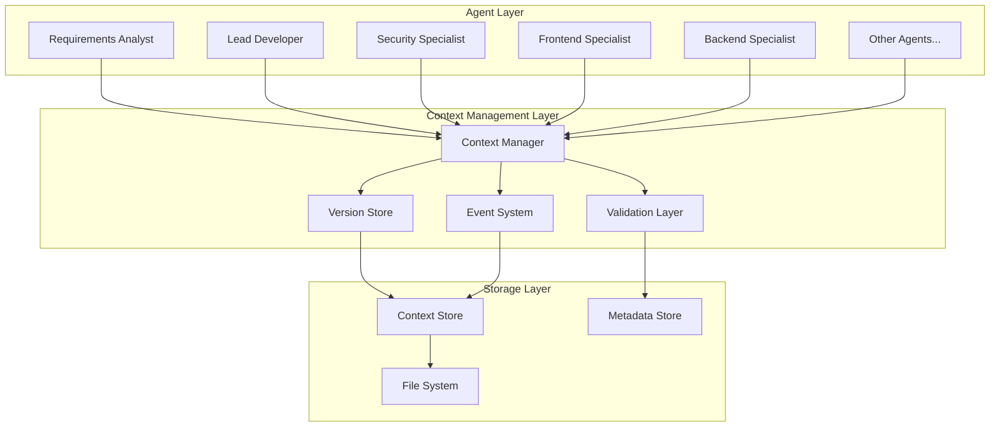

# Centralized Context Management System Design

## Executive Summary

This document specifies a centralized context management system that eliminates context fragmentation in multi-agent workflows, ensures consistency across parallel execution paths, and provides robust state coordination for the agentic software development system.

## Problem Statement

### Current Issues Identified

1. **Context Fragmentation**: Agents may read outdated files if updates occur mid-workflow
2. **Inconsistent Cross-Cutting Concerns**: Security, performance, and quality requirements applied inconsistently
3. **Parallel Coordination Challenges**: No mechanism for concurrent agents to share state safely
4. **Version Drift**: Agents may work with different versions of project context
5. **Missing Validation**: No systematic verification of context completeness and integrity

### Requirements

- **Single Source of Truth**: Centralized project context accessible to all agents
- **Version Control**: Immutable context snapshots with change tracking
- **Parallel Safety**: Support multiple agents reading/writing concurrently
- **Cross-Cutting Integration**: Consistent application of security, performance, quality concerns
- **Validation Framework**: Automated context integrity and completeness checks
- **Event System**: Real-time notifications for context changes
- **Rollback Capability**: Ability to revert to previous context states

## Architecture Overview

### High-Level Design



### Core Components

1. **Context Manager**: Central coordinator for all context operations
2. **Version Store**: Immutable snapshots with change tracking
3. **Validation Layer**: Automated integrity and completeness checks
4. **Event System**: Real-time change notifications
5. **Context Store**: Persistent storage with transaction support
6. **Metadata Store**: Context schemas, validation rules, and audit trails

## Data Structures and Schemas

### Context Object Schema

```typescript
interface ProjectContext {
  id: string
  version: number
  timestamp: string
  checksum: string
  
  // Core Project Information
  metadata: {
    name: string
    description: string
    domain: string
    technology_stack: TechnologyStack
    compliance_requirements: string[]
  }
  
  // Agent Outputs
  requirements: RequirementsData | null
  architecture: ArchitectureData | null
  security_design: SecurityData | null
  database_design: DatabaseData | null
  ui_design: UIDesignData | null
  implementation_progress: ImplementationData | null
  
  // Cross-Cutting Concerns
  cross_cutting: {
    security_requirements: SecurityRequirement[]
    performance_requirements: PerformanceRequirement[]
    quality_standards: QualityStandard[]
    compliance_controls: ComplianceControl[]
  }
  
  // Workflow State
  workflow_state: {
    active_agents: AgentState[]
    completed_phases: string[]
    pending_validations: ValidationTask[]
    blockers: BlockerInfo[]
  }
  
  // Validation Status
  validation: {
    schema_valid: boolean
    completeness_score: number
    consistency_checks: ConsistencyCheck[]
    last_validated: string
  }
}

interface AgentState {
  agent_name: string
  status: 'pending' | 'in_progress' | 'completed' | 'blocked'
  started_at: string | null
  completed_at: string | null
  context_version: number
  outputs: string[]
  dependencies_met: boolean
}
```

### Version Control Schema

```typescript
interface ContextVersion {
  version: number
  parent_version: number | null
  created_by: string // agent name
  created_at: string
  change_summary: string
  changes: ContextChange[]
  context_snapshot: ProjectContext
}

interface ContextChange {
  path: string // JSON path to changed field
  operation: 'create' | 'update' | 'delete'
  old_value: any
  new_value: any
  agent_name: string
  validation_passed: boolean
}
```

## Context Manager API

### Core Operations

```typescript
class ContextManager {
  // Context Lifecycle
  async createContext(initial_data: Partial<ProjectContext>): Promise<string>
  async getContext(context_id: string, version?: number): Promise<ProjectContext>
  async updateContext(context_id: string, updates: ContextUpdate[], agent_name: string): Promise<number>
  async validateContext(context_id: string): Promise<ValidationResult>
  
  // Version Management
  async getVersionHistory(context_id: string): Promise<ContextVersion[]>
  async rollbackToVersion(context_id: string, version: number): Promise<void>
  async createBranch(context_id: string, branch_name: string): Promise<string>
  async mergeBranch(context_id: string, branch_name: string): Promise<void>
  
  // Agent Coordination
  async registerAgent(context_id: string, agent_name: string): Promise<AgentToken>
  async claimWorkItem(context_id: string, agent_name: string): Promise<WorkItem | null>
  async reportProgress(context_id: string, agent_name: string, progress: AgentProgress): Promise<void>
  async completeWork(context_id: string, agent_name: string, outputs: AgentOutput[]): Promise<void>
  
  // Cross-Cutting Concerns
  async addSecurityRequirement(context_id: string, requirement: SecurityRequirement): Promise<void>
  async addPerformanceRequirement(context_id: string, requirement: PerformanceRequirement): Promise<void>
  async getApplicableStandards(context_id: string, domain: string): Promise<QualityStandard[]>
  
  // Event System
  async subscribe(context_id: string, agent_name: string, events: string[]): Promise<EventSubscription>
  async unsubscribe(subscription: EventSubscription): Promise<void>
  
  // Queries
  async getAgentDependencies(context_id: string, agent_name: string): Promise<AgentDependency[]>
  async getParallelExecutionPlan(context_id: string): Promise<ExecutionPlan>
  async getContextHealth(context_id: string): Promise<HealthReport>
}
```

### Usage Patterns for Agents

```typescript
// Agent initialization pattern
class BaseAgent {
  protected context_manager: ContextManager
  protected context_id: string
  protected agent_token: AgentToken
  
  async initialize() {
    this.agent_token = await this.context_manager.registerAgent(
      this.context_id, 
      this.agent_name
    )
    
    // Subscribe to relevant context changes
    await this.context_manager.subscribe(
      this.context_id,
      this.agent_name,
      this.getRelevantEvents()
    )
  }
  
  async execute() {
    // Get current context
    const context = await this.context_manager.getContext(this.context_id)
    
    // Validate dependencies are met
    const dependencies = await this.context_manager.getAgentDependencies(
      this.context_id,
      this.agent_name
    )
    
    if (!this.dependenciesMet(dependencies)) {
      throw new Error(`Dependencies not met: ${dependencies}`)
    }
    
    // Report start of work
    await this.context_manager.reportProgress(
      this.context_id,
      this.agent_name,
      { status: 'in_progress', started_at: new Date().toISOString() }
    )
    
    try {
      // Perform agent work
      const outputs = await this.performWork(context)
      
      // Update context with results
      await this.context_manager.updateContext(
        this.context_id,
        this.buildContextUpdates(outputs),
        this.agent_name
      )
      
      // Report completion
      await this.context_manager.completeWork(
        this.context_id,
        this.agent_name,
        outputs
      )
      
    } catch (error) {
      await this.context_manager.reportProgress(
        this.context_id,
        this.agent_name,
        { status: 'blocked', error: error.message }
      )
      throw error
    }
  }
}
```

## Cross-Cutting Concerns Integration

### Security Context Propagation

```typescript
interface SecurityContext {
  // Automatically applied to all agents
  threat_model: ThreatModel
  security_controls: SecurityControl[]
  compliance_requirements: ComplianceRequirement[]
  data_classification: DataClassification
  
  // Agent-specific security requirements
  agent_security_requirements: {
    [agent_name: string]: AgentSecurityRequirement[]
  }
}

// Example: Security requirements automatically applied
class SecurityAwareAgent extends BaseAgent {
  async performWork(context: ProjectContext) {
    // Security controls automatically available
    const security_context = context.cross_cutting.security_requirements
    
    // Apply security controls specific to this agent
    const my_security_reqs = security_context.agent_security_requirements[this.agent_name] || []
    
    this.applySecurityControls(my_security_reqs)
    
    // Perform work with security context
    return await this.doSecureWork(context)
  }
}
```

### Performance Context Integration

```typescript
interface PerformanceContext {
  performance_requirements: {
    response_time_ms: number
    throughput_rps: number
    memory_limit_mb: number
    cpu_limit_percent: number
  }
  
  monitoring_requirements: {
    metrics_to_track: string[]
    alerting_thresholds: AlertThreshold[]
    sla_requirements: SLARequirement[]
  }
}
```

## Validation Framework

### Context Validation Rules

```typescript
interface ValidationRule {
  name: string
  description: string
  severity: 'error' | 'warning' | 'info'
  check: (context: ProjectContext) => ValidationResult
}

const BUILT_IN_VALIDATION_RULES: ValidationRule[] = [
  {
    name: 'requirements_completeness',
    description: 'All user stories have acceptance criteria',
    severity: 'error',
    check: (context) => {
      const requirements = context.requirements
      if (!requirements) return { valid: false, message: 'Requirements not defined' }
      
      const incomplete_stories = requirements.user_stories.filter(
        story => !story.acceptance_criteria || story.acceptance_criteria.length === 0
      )
      
      return {
        valid: incomplete_stories.length === 0,
        message: incomplete_stories.length > 0 
          ? `${incomplete_stories.length} user stories missing acceptance criteria`
          : 'All user stories have acceptance criteria'
      }
    }
  },
  
  {
    name: 'security_architecture_alignment',
    description: 'Security design aligns with architecture decisions',
    severity: 'error',
    check: (context) => {
      const architecture = context.architecture
      const security = context.security_design
      
      if (!architecture || !security) {
        return { valid: false, message: 'Architecture or security design missing' }
      }
      
      // Check alignment between architecture and security
      const misalignments = []
      
      // Example: Check if web framework security is addressed
      if (architecture.frontend_framework && !security.web_security_controls) {
        misalignments.push('Web application security controls not defined')
      }
      
      return {
        valid: misalignments.length === 0,
        message: misalignments.length > 0 
          ? `Security/architecture misalignments: ${misalignments.join(', ')}`
          : 'Security design aligns with architecture'
      }
    }
  },
  
  {
    name: 'cross_cutting_consistency',
    description: 'Cross-cutting concerns consistently applied',
    severity: 'warning',
    check: (context) => {
      const cross_cutting = context.cross_cutting
      const inconsistencies = []
      
      // Check if security requirements are reflected in all relevant outputs
      if (cross_cutting.security_requirements.length > 0) {
        if (!context.security_design) {
          inconsistencies.push('Security requirements defined but no security design')
        }
        if (!context.architecture?.security_considerations) {
          inconsistencies.push('Security requirements not reflected in architecture')
        }
      }
      
      return {
        valid: inconsistencies.length === 0,
        message: inconsistencies.length > 0
          ? `Cross-cutting inconsistencies: ${inconsistencies.join(', ')}`
          : 'Cross-cutting concerns consistently applied'
      }
    }
  }
]
```

### Automated Validation Pipeline

```typescript
class ValidationPipeline {
  private rules: ValidationRule[]
  
  async validateContext(context: ProjectContext): Promise<ValidationReport> {
    const results: ValidationResult[] = []
    
    for (const rule of this.rules) {
      try {
        const result = await rule.check(context)
        results.push({
          rule_name: rule.name,
          severity: rule.severity,
          ...result
        })
      } catch (error) {
        results.push({
          rule_name: rule.name,
          severity: 'error',
          valid: false,
          message: `Validation rule failed: ${error.message}`
        })
      }
    }
    
    const errors = results.filter(r => r.severity === 'error' && !r.valid)
    const warnings = results.filter(r => r.severity === 'warning' && !r.valid)
    
    return {
      overall_valid: errors.length === 0,
      completeness_score: this.calculateCompletenessScore(context),
      error_count: errors.length,
      warning_count: warnings.length,
      results,
      recommendations: this.generateRecommendations(results)
    }
  }
  
  private calculateCompletenessScore(context: ProjectContext): number {
    const components = [
      'requirements', 'architecture', 'security_design', 
      'database_design', 'ui_design'
    ]
    
    const completed = components.filter(comp => context[comp] !== null).length
    return (completed / components.length) * 100
  }
}
```

## Event System

### Event Types and Payloads

```typescript
interface ContextEvent {
  event_id: string
  context_id: string
  event_type: string
  timestamp: string
  agent_name: string
  payload: any
}

// Standard event types
const EVENT_TYPES = {
  CONTEXT_CREATED: 'context.created',
  CONTEXT_UPDATED: 'context.updated',
  AGENT_STARTED: 'agent.started',
  AGENT_COMPLETED: 'agent.completed',
  AGENT_BLOCKED: 'agent.blocked',
  VALIDATION_FAILED: 'validation.failed',
  CROSS_CUTTING_UPDATED: 'cross_cutting.updated',
  DEPENDENCY_RESOLVED: 'dependency.resolved'
}

// Event subscription patterns
interface EventSubscription {
  subscription_id: string
  context_id: string
  agent_name: string
  event_patterns: string[] // e.g., ['agent.*', 'context.updated']
  callback_url?: string
  active: boolean
}
```

### Real-Time Coordination Example

```typescript
// Example: Backend Specialist waits for Security design completion
class BackendSpecialist extends BaseAgent {
  async execute() {
    const context = await this.context_manager.getContext(this.context_id)
    
    // Check if security design is available
    if (!context.security_design) {
      console.log('Waiting for security design completion...')
      
      // Subscribe to security completion events
      await this.context_manager.subscribe(
        this.context_id,
        this.agent_name,
        ['agent.completed:security-specialist']
      )
      
      // Wait for security design
      await this.waitForEvent('agent.completed:security-specialist')
    }
    
    // Proceed with backend implementation
    await super.execute()
  }
}
```

## Parallel Execution Support

### Execution Planning

```typescript
interface ExecutionPlan {
  phases: ExecutionPhase[]
  parallel_groups: ParallelGroup[]
  dependencies: AgentDependency[]
  estimated_duration: number
}

interface ParallelGroup {
  group_id: string
  agents: string[]
  shared_resources: string[]
  merge_strategy: 'last_writer_wins' | 'conflict_resolution' | 'manual_merge'
}

class ExecutionPlanner {
  generatePlan(context: ProjectContext): ExecutionPlan {
    const agent_configs = this.loadAgentConfigurations()
    const dependency_graph = this.buildDependencyGraph(agent_configs)
    
    return {
      phases: this.identifyPhases(dependency_graph),
      parallel_groups: this.identifyParallelOpportunities(dependency_graph),
      dependencies: this.extractDependencies(dependency_graph),
      estimated_duration: this.estimateDuration(dependency_graph)
    }
  }
  
  private identifyParallelOpportunities(graph: DependencyGraph): ParallelGroup[] {
    // Identify agents that can run concurrently
    const parallel_groups: ParallelGroup[] = []
    
    // Example: Security and Database specialists can work in parallel
    // if they both depend on architecture but not on each other
    const architecture_dependents = graph.getDependents('software-architect')
    const parallel_candidates = architecture_dependents.filter(agent => 
      !graph.hasDependencyBetween(agent, architecture_dependents)
    )
    
    if (parallel_candidates.length > 1) {
      parallel_groups.push({
        group_id: 'post-architecture-parallel',
        agents: parallel_candidates,
        shared_resources: ['architecture-design'],
        merge_strategy: 'conflict_resolution'
      })
    }
    
    return parallel_groups
  }
}
```

### Conflict Resolution

```typescript
interface ConflictResolution {
  conflict_type: 'resource_contention' | 'data_inconsistency' | 'constraint_violation'
  agents_involved: string[]
  resource_path: string
  resolution_strategy: 'merge' | 'prioritize' | 'escalate'
  resolution_data: any
}

class ConflictResolver {
  async resolveConflict(
    context_id: string, 
    conflict: ConflictResolution
  ): Promise<ConflictResolution> {
    
    switch (conflict.resolution_strategy) {
      case 'merge':
        return await this.attemptMerge(context_id, conflict)
      
      case 'prioritize':
        return await this.applyPrioritization(context_id, conflict)
      
      case 'escalate':
        return await this.escalateToOrchestrator(context_id, conflict)
      
      default:
        throw new Error(`Unknown resolution strategy: ${conflict.resolution_strategy}`)
    }
  }
  
  private async attemptMerge(context_id: string, conflict: ConflictResolution): Promise<ConflictResolution> {
    // Implement intelligent merging based on conflict type
    // For example: merge security requirements from multiple agents
    // by combining them into a comprehensive set
    
    if (conflict.resource_path.startsWith('cross_cutting.security_requirements')) {
      return await this.mergeSecurityRequirements(context_id, conflict)
    }
    
    // Default to manual resolution for complex conflicts
    return { ...conflict, resolution_strategy: 'escalate' }
  }
}
```

## Implementation Strategy

### Phase 1: Core Infrastructure

1. **Context Store Implementation**
   - File-based storage with JSON Schema validation
   - Atomic operations with file locking
   - Basic version control with git-like snapshots

2. **Context Manager API**
   - RESTful API with TypeScript SDK
   - Basic CRUD operations for context management
   - Simple agent registration and progress tracking

3. **Basic Validation**
   - Schema validation for context objects
   - Simple completeness checks
   - Manual validation trigger

### Phase 2: Advanced Features

1. **Event System**
   - WebSocket-based real-time notifications
   - Event subscription and filtering
   - Event replay and audit trail

2. **Parallel Execution Support**
   - Dependency graph analysis
   - Automatic parallel group identification
   - Basic conflict detection

3. **Enhanced Validation**
   - Custom validation rule engine
   - Automated validation pipeline
   - Validation reporting and recommendations

### Phase 3: Production Features

1. **Scalability Improvements**
   - Database backend (PostgreSQL/MongoDB)
   - Distributed event system (Redis/RabbitMQ)
   - Horizontal scaling support

2. **Advanced Conflict Resolution**
   - Machine learning-based conflict prediction
   - Intelligent merging strategies
   - Automated resolution workflows

3. **Monitoring and Observability**
   - Context health monitoring
   - Performance metrics and alerts
   - Audit trail and compliance reporting

## Integration with Existing System

### Migration Path

1. **Backward Compatibility Layer**
   - Current `ai_docs/` files mapped to context objects
   - Gradual migration of agents to use Context Manager API
   - Fallback to file system for non-migrated agents

2. **Agent Integration**
   - Update agent base class to use Context Manager
   - Modify orchestrator to use centralized context
   - Add context validation to agent workflows

3. **Testing Strategy**
   - Unit tests for all Context Manager components
   - Integration tests with sample agent workflows
   - Performance testing with parallel execution scenarios

### Configuration

```yaml
# context-manager.yml
context_manager:
  storage:
    type: file_system # or: database
    path: ./context_store
    backup_enabled: true
    backup_interval: 3600 # seconds
  
  validation:
    enabled: true
    auto_validate: true
    rules_path: ./validation_rules
    strict_mode: false
  
  events:
    enabled: true
    persistence: true
    max_event_age: 86400 # seconds
  
  parallel_execution:
    enabled: true
    max_concurrent_agents: 5
    conflict_resolution: auto # or: manual
  
  monitoring:
    metrics_enabled: true
    health_check_interval: 60 # seconds
    alert_on_validation_failure: true
```

## Benefits and Impact

### Immediate Benefits

1. **Consistency**: All agents work with the same context version
2. **Traceability**: Complete audit trail of all context changes
3. **Reliability**: Automated validation prevents context corruption
4. **Coordination**: Better coordination between parallel agents

### Long-Term Benefits

1. **Scalability**: Support for larger, more complex projects
2. **Quality**: Higher quality outputs through systematic validation
3. **Efficiency**: Reduced coordination overhead and faster parallel execution
4. **Maintainability**: Easier debugging and troubleshooting of agent workflows

This centralized context management system provides the foundation for robust, scalable multi-agent coordination while maintaining the flexibility and power of the existing agentic software development system.