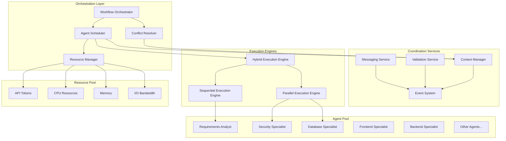

# Hybrid Workflow Coordination Framework

## Executive Summary

This document defines a hybrid workflow coordination framework that dynamically adapts between sequential and parallel execution patterns, optimizes resource utilization, and provides robust coordination mechanisms for the multi-agent software development system. The framework integrates with centralized context management and standardized handoff validation to ensure quality while maximizing efficiency.

## Problem Statement

### Current Workflow Limitations

1. **Static Sequential Execution**: Current workflow follows rigid sequential handoffs, missing parallelization opportunities
2. **Resource Inefficiency**: Agents wait unnecessarily when they could work concurrently on independent tasks
3. **Poor Failure Recovery**: Single agent failures can block entire workflow progression
4. **Manual Coordination**: No automated coordination for agents working on related concerns
5. **Context Fragmentation**: Parallel agents may work with inconsistent context snapshots
6. **Optimization Gaps**: No intelligent scheduling based on agent capabilities and workload

### Framework Requirements

- **Dynamic Execution Patterns**: Switch between sequential and parallel execution based on dependencies
- **Intelligent Scheduling**: Optimal agent assignment considering workload, capabilities, and resource constraints
- **Real-Time Coordination**: Live synchronization between concurrent agents
- **Conflict Resolution**: Automated detection and resolution of overlapping work
- **Resource Optimization**: Efficient API usage and computational resource allocation
- **Robust Failure Handling**: Graceful degradation and recovery from agent failures
- **Quality Preservation**: Maintain quality gates while enabling parallel execution

## Architecture Overview

### Framework Components



### Core Framework Features

1. **Workflow Orchestrator**: Central coordination engine that analyzes dependencies and makes execution decisions
2. **Agent Scheduler**: Intelligent assignment of agents to work based on capabilities, load, and resource availability
3. **Hybrid Execution Engine**: Dynamically switches between sequential and parallel execution patterns
4. **Conflict Resolver**: Detects and resolves conflicts when agents work on overlapping concerns
5. **Resource Manager**: Optimizes allocation of API tokens, CPU, memory, and I/O resources
6. **Real-Time Coordination**: Event-driven synchronization between concurrent agents

## Dynamic Workflow Analysis

### Dependency Graph Construction

```typescript
interface WorkflowNode {
  agent_name: string
  dependencies: string[]
  parallel_capable: boolean
  estimated_duration: number
  resource_requirements: ResourceRequirements
  output_dependencies: string[]
  conflict_domains: string[]
}

interface WorkflowEdge {
  from_agent: string
  to_agent: string
  dependency_type: 'hard' | 'soft' | 'conditional'
  data_requirements: string[]
  validation_requirements: ValidationRequirement[]
}

class WorkflowAnalyzer {
  private agents: Map<string, AgentConfiguration>
  private context: ProjectContext
  
  constructor(agents: Map<string, AgentConfiguration>, context: ProjectContext) {
    this.agents = agents
    this.context = context
  }
  
  analyzeWorkflow(requested_agents: string[]): WorkflowAnalysis {
    // Build dependency graph
    const dependency_graph = this.buildDependencyGraph(requested_agents)
    
    // Identify parallel opportunities
    const parallel_groups = this.identifyParallelGroups(dependency_graph)
    
    // Calculate resource requirements
    const resource_requirements = this.calculateResourceRequirements(dependency_graph)
    
    // Estimate execution time
    const time_estimates = this.estimateExecutionTime(dependency_graph, parallel_groups)
    
    // Identify potential conflicts
    const conflict_analysis = this.analyzeConflicts(parallel_groups)
    
    return {
      dependency_graph,
      parallel_groups,
      resource_requirements,
      time_estimates,
      conflict_analysis,
      optimization_opportunities: this.identifyOptimizations(dependency_graph, parallel_groups)
    }
  }
  
  private identifyParallelGroups(graph: DependencyGraph): ParallelGroup[] {
    const parallel_groups: ParallelGroup[] = []
    const visited = new Set<string>()
    
    // Find agents with same dependencies that can run in parallel
    for (const node of graph.nodes) {
      if (visited.has(node.agent_name) || !node.parallel_capable) continue
      
      const compatible_agents = this.findCompatibleAgents(node, graph, visited)
      
      if (compatible_agents.length > 1) {
        parallel_groups.push({
          group_id: `parallel-${parallel_groups.length + 1}`,
          agents: compatible_agents.map(a => a.agent_name),
          shared_dependencies: this.findSharedDependencies(compatible_agents),
          conflict_resolution_strategy: this.determineConflictStrategy(compatible_agents),
          merge_strategy: this.determineMergeStrategy(compatible_agents),
          estimated_duration: Math.max(...compatible_agents.map(a => a.estimated_duration))
        })
        
        compatible_agents.forEach(agent => visited.add(agent.agent_name))
      }
    }
    
    return parallel_groups
  }
  
  private findCompatibleAgents(
    source_node: WorkflowNode, 
    graph: DependencyGraph, 
    visited: Set<string>
  ): WorkflowNode[] {
    const compatible: WorkflowNode[] = [source_node]
    
    for (const candidate of graph.nodes) {
      if (visited.has(candidate.agent_name) || 
          candidate.agent_name === source_node.agent_name ||
          !candidate.parallel_capable) {
        continue
      }
      
      // Check if agents can run in parallel
      if (this.canRunInParallel(source_node, candidate, graph)) {
        compatible.push(candidate)
      }
    }
    
    return compatible
  }
  
  private canRunInParallel(agent1: WorkflowNode, agent2: WorkflowNode, graph: DependencyGraph): boolean {
    // Agents can run in parallel if:
    // 1. They have the same dependencies (can start at same time)
    // 2. They don't depend on each other
    // 3. Their conflict domains don't overlap critically
    // 4. Resource requirements don't exceed limits
    
    const same_dependencies = this.haveSameDependencies(agent1, agent2)
    const no_mutual_dependency = !this.hasMutualDependency(agent1, agent2, graph)
    const compatible_conflicts = this.areConflictDomainsCompatible(agent1, agent2)
    const resource_compatible = this.areResourcesCompatible(agent1, agent2)
    
    return same_dependencies && no_mutual_dependency && compatible_conflicts && resource_compatible
  }
  
  private determineConflictStrategy(agents: WorkflowNode[]): ConflictResolutionStrategy {
    const conflict_domains = agents.flatMap(a => a.conflict_domains)
    const unique_conflicts = [...new Set(conflict_domains)]
    
    if (unique_conflicts.length === 0) {
      return { type: 'none', reason: 'No conflicts detected' }
    }
    
    // Check for critical conflicts that require sequential execution
    const critical_conflicts = unique_conflicts.filter(domain => 
      this.isCriticalConflictDomain(domain)
    )
    
    if (critical_conflicts.length > 0) {
      return { 
        type: 'sequential_fallback', 
        reason: `Critical conflicts in: ${critical_conflicts.join(', ')}`,
        fallback_order: this.determineFallbackOrder(agents, critical_conflicts)
      }
    }
    
    // Determine merge strategy for non-critical conflicts
    const merge_complexity = this.assessMergeComplexity(unique_conflicts)
    
    if (merge_complexity < 0.3) {
      return { type: 'automatic_merge', confidence: 1 - merge_complexity }
    } else if (merge_complexity < 0.7) {
      return { type: 'guided_merge', merge_guidance: this.generateMergeGuidance(unique_conflicts) }
    } else {
      return { type: 'human_review', reason: 'Merge complexity too high for automation' }
    }
  }
}
```

### Intelligent Agent Scheduling

```typescript
interface SchedulingDecision {
  execution_plan: ExecutionPlan
  resource_allocation: ResourceAllocation
  coordination_requirements: CoordinationRequirement[]
  fallback_strategies: FallbackStrategy[]
}

class AgentScheduler {
  private resource_manager: ResourceManager
  private context_manager: ContextManager
  private performance_tracker: PerformanceTracker
  
  async scheduleWorkflow(workflow_analysis: WorkflowAnalysis): Promise<SchedulingDecision> {
    // Get current resource availability
    const available_resources = await this.resource_manager.getAvailableResources()
    
    // Analyze agent performance history
    const performance_data = await this.performance_tracker.getAgentPerformanceData()
    
    // Generate scheduling options
    const scheduling_options = this.generateSchedulingOptions(
      workflow_analysis,
      available_resources,
      performance_data
    )
    
    // Select optimal schedule
    const optimal_schedule = this.selectOptimalSchedule(scheduling_options)
    
    // Prepare execution plan
    const execution_plan = await this.prepareExecutionPlan(optimal_schedule)
    
    return {
      execution_plan,
      resource_allocation: optimal_schedule.resource_allocation,
      coordination_requirements: this.determineCoordinationRequirements(execution_plan),
      fallback_strategies: this.prepareFallbackStrategies(workflow_analysis, optimal_schedule)
    }
  }
  
  private generateSchedulingOptions(
    analysis: WorkflowAnalysis,
    resources: AvailableResources,
    performance: PerformanceData
  ): SchedulingOption[] {
    const options: SchedulingOption[] = []
    
    // Option 1: Pure sequential execution (baseline)
    options.push(this.generateSequentialOption(analysis, resources, performance))
    
    // Option 2: Maximum parallelization
    if (this.canSupportParallelExecution(analysis.parallel_groups, resources)) {
      options.push(this.generateParallelOption(analysis, resources, performance))
    }
    
    // Option 3: Hybrid approaches
    for (const hybrid_config of this.generateHybridConfigurations(analysis)) {
      if (this.isHybridConfigFeasible(hybrid_config, resources)) {
        options.push(this.generateHybridOption(hybrid_config, analysis, resources, performance))
      }
    }
    
    // Option 4: Resource-constrained optimizations
    if (resources.api_tokens < analysis.resource_requirements.api_tokens) {
      options.push(this.generateResourceConstrainedOption(analysis, resources, performance))
    }
    
    return options
  }
  
  private selectOptimalSchedule(options: SchedulingOption[]): SchedulingOption {
    // Multi-criteria optimization considering:
    // - Total execution time
    // - Resource efficiency
    // - Risk factors
    // - Quality preservation
    
    return options.reduce((best, current) => {
      const best_score = this.calculateScheduleScore(best)
      const current_score = this.calculateScheduleScore(current)
      
      return current_score > best_score ? current : best
    })
  }
  
  private calculateScheduleScore(option: SchedulingOption): number {
    const weights = {
      time_efficiency: 0.35,      // Faster execution preferred
      resource_efficiency: 0.25,  // Lower resource usage preferred
      quality_preservation: 0.25, // Quality gates maintained
      risk_mitigation: 0.15       // Lower failure risk preferred
    }
    
    const time_score = 1 - (option.estimated_duration / option.max_possible_duration)
    const resource_score = 1 - (option.resource_usage / option.max_resource_limit)
    const quality_score = option.quality_preservation_score
    const risk_score = 1 - option.failure_risk_score
    
    return (
      weights.time_efficiency * time_score +
      weights.resource_efficiency * resource_score +
      weights.quality_preservation * quality_score +
      weights.risk_mitigation * risk_score
    )
  }
}
```

## Real-Time Coordination Mechanisms

### Event-Driven Synchronization

```typescript
interface CoordinationEvent {
  event_id: string
  timestamp: string
  source_agent: string
  event_type: CoordinationEventType
  affected_agents: string[]
  data: any
  priority: 'low' | 'medium' | 'high' | 'critical'
}

enum CoordinationEventType {
  AGENT_STARTED = 'agent.started',
  AGENT_PROGRESS = 'agent.progress',
  AGENT_COMPLETED = 'agent.completed',
  AGENT_BLOCKED = 'agent.blocked',
  CONTEXT_UPDATED = 'context.updated',
  CONFLICT_DETECTED = 'conflict.detected',
  RESOURCE_SHORTAGE = 'resource.shortage',
  QUALITY_GATE_FAILED = 'quality.gate_failed',
  HANDOFF_READY = 'handoff.ready'
}

class RealTimeCoordinator {
  private event_bus: EventBus
  private coordination_rules: CoordinationRule[]
  private active_coordinators: Map<string, AgentCoordinator> = new Map()
  
  async startWorkflowCoordination(execution_plan: ExecutionPlan): Promise<void> {
    // Set up coordination for each parallel group
    for (const group of execution_plan.parallel_groups) {
      const coordinator = new ParallelGroupCoordinator(
        group,
        this.event_bus,
        this.coordination_rules
      )
      
      await coordinator.initialize()
      this.active_coordinators.set(group.group_id, coordinator)
    }
    
    // Set up global coordination rules
    await this.setupGlobalCoordinationRules(execution_plan)
    
    // Start event monitoring
    this.event_bus.subscribe('*', this.handleCoordinationEvent.bind(this))
  }
  
  private async handleCoordinationEvent(event: CoordinationEvent): Promise<void> {
    console.log(`[Coordinator] Handling ${event.event_type} from ${event.source_agent}`)
    
    switch (event.event_type) {
      case CoordinationEventType.CONTEXT_UPDATED:
        await this.handleContextUpdate(event)
        break
        
      case CoordinationEventType.CONFLICT_DETECTED:
        await this.handleConflictDetection(event)
        break
        
      case CoordinationEventType.AGENT_BLOCKED:
        await this.handleAgentBlocked(event)
        break
        
      case CoordinationEventType.RESOURCE_SHORTAGE:
        await this.handleResourceShortage(event)
        break
        
      case CoordinationEventType.QUALITY_GATE_FAILED:
        await this.handleQualityGateFailure(event)
        break
        
      default:
        await this.routeEventToRelevantCoordinators(event)
    }
  }
  
  private async handleContextUpdate(event: CoordinationEvent): Promise<void> {
    const context_update = event.data as ContextUpdate
    
    // Determine which agents need to be notified
    const affected_agents = await this.determineAffectedAgents(context_update)
    
    // Check for consistency issues
    const consistency_issues = await this.checkContextConsistency(context_update, affected_agents)
    
    if (consistency_issues.length > 0) {
      await this.event_bus.publish({
        event_id: uuidv4(),
        timestamp: new Date().toISOString(),
        source_agent: 'coordination-system',
        event_type: CoordinationEventType.CONFLICT_DETECTED,
        affected_agents,
        data: { consistency_issues, original_update: context_update },
        priority: 'high'
      })
    } else {
      // Propagate update to affected agents
      for (const agent of affected_agents) {
        await this.notifyAgentOfContextUpdate(agent, context_update)
      }
    }
  }
  
  private async handleConflictDetection(event: CoordinationEvent): Promise<void> {
    const conflict_data = event.data as ConflictData
    const resolution_strategy = await this.determineConflictResolution(conflict_data)
    
    switch (resolution_strategy.type) {
      case 'automatic_merge':
        await this.performAutomaticMerge(conflict_data, resolution_strategy)
        break
        
      case 'guided_merge':
        await this.initiateGuidedMerge(conflict_data, resolution_strategy)
        break
        
      case 'sequential_fallback':
        await this.fallbackToSequentialExecution(conflict_data, resolution_strategy)
        break
        
      case 'human_escalation':
        await this.escalateConflictToHuman(conflict_data, resolution_strategy)
        break
    }
  }
}
```

### Parallel Group Coordination

```typescript
class ParallelGroupCoordinator {
  private group: ParallelGroup
  private agent_states: Map<string, AgentExecutionState> = new Map()
  private shared_context: SharedContext
  private synchronization_points: SynchronizationPoint[]
  
  constructor(
    group: ParallelGroup,
    private event_bus: EventBus,
    private coordination_rules: CoordinationRule[]
  ) {
    this.group = group
    this.shared_context = new SharedContext(group.shared_dependencies)
  }
  
  async initialize(): Promise<void> {
    // Set up agent execution states
    for (const agent_name of this.group.agents) {
      this.agent_states.set(agent_name, {
        agent_name,
        status: 'pending',
        started_at: null,
        last_update: null,
        progress_percentage: 0,
        current_phase: 'initializing',
        blockers: [],
        context_version: 0
      })
    }
    
    // Identify synchronization points
    this.synchronization_points = await this.identifySynchronizationPoints()
    
    // Subscribe to relevant events
    const event_patterns = [
      `agent.*.${this.group.agents.join('|')}`,
      `context.updated`,
      `handoff.ready`
    ]
    
    for (const pattern of event_patterns) {
      this.event_bus.subscribe(pattern, this.handleGroupEvent.bind(this))
    }
  }
  
  private async handleGroupEvent(event: CoordinationEvent): Promise<void> {
    if (this.group.agents.includes(event.source_agent)) {
      await this.updateAgentState(event)
      await this.checkSynchronizationPoints()
      await this.manageConflicts(event)
    }
  }
  
  private async checkSynchronizationPoints(): Promise<void> {
    for (const sync_point of this.synchronization_points) {
      if (sync_point.status === 'pending' && this.isSyncPointReady(sync_point)) {
        await this.executeSynchronizationPoint(sync_point)
      }
    }
  }
  
  private async executeSynchronizationPoint(sync_point: SynchronizationPoint): Promise<void> {
    console.log(`[ParallelGroup:${this.group.group_id}] Executing sync point: ${sync_point.name}`)
    
    sync_point.status = 'executing'
    
    try {
      switch (sync_point.type) {
        case 'context_merge':
          await this.performContextMerge(sync_point)
          break
          
        case 'progress_checkpoint':
          await this.performProgressCheckpoint(sync_point)
          break
          
        case 'quality_gate':
          await this.performQualityGate(sync_point)
          break
          
        case 'resource_rebalancing':
          await this.performResourceRebalancing(sync_point)
          break
      }
      
      sync_point.status = 'completed'
      sync_point.completed_at = new Date().toISOString()
      
      // Notify agents that sync point is complete
      await this.notifyAgentsOfSyncCompletion(sync_point)
      
    } catch (error) {
      sync_point.status = 'failed'
      sync_point.error = error.message
      
      // Handle synchronization failure
      await this.handleSyncPointFailure(sync_point, error)
    }
  }
  
  private async performContextMerge(sync_point: SynchronizationPoint): Promise<void> {
    const agent_contexts = await this.gatherAgentContexts(sync_point.participating_agents)
    
    // Detect conflicts in agent outputs
    const conflicts = this.detectContextConflicts(agent_contexts)
    
    if (conflicts.length === 0) {
      // Simple merge - no conflicts
      const merged_context = this.mergeContextsSimple(agent_contexts)
      await this.shared_context.update(merged_context)
    } else {
      // Complex merge - resolve conflicts
      const resolution_strategy = this.group.conflict_resolution_strategy
      
      switch (resolution_strategy.type) {
        case 'automatic_merge':
          const resolved_context = await this.resolveConflictsAutomatically(agent_contexts, conflicts)
          await this.shared_context.update(resolved_context)
          break
          
        case 'guided_merge':
          const guidance = await this.generateMergeGuidance(conflicts)
          await this.requestGuidedMerge(agent_contexts, conflicts, guidance)
          break
          
        case 'sequential_fallback':
          await this.initiateSequentialFallback(sync_point.participating_agents)
          break
      }
    }
  }
}
```

## Resource Management and Optimization

### Intelligent Resource Allocation

```typescript
interface ResourceConstraints {
  max_concurrent_agents: number
  api_token_limit: number
  memory_limit_mb: number
  cpu_core_limit: number
  io_bandwidth_limit: number
}

interface ResourceUsagePattern {
  agent_name: string
  typical_api_calls: number
  memory_usage_mb: number
  cpu_utilization: number
  io_operations: number
  duration_minutes: number
}

class ResourceManager {
  private constraints: ResourceConstraints
  private current_usage: ResourceUsage
  private usage_patterns: Map<string, ResourceUsagePattern>
  private allocation_history: AllocationHistory[]
  
  constructor(constraints: ResourceConstraints) {
    this.constraints = constraints
    this.current_usage = this.initializeUsageTracking()
    this.usage_patterns = new Map()
  }
  
  async allocateResourcesForExecution(execution_plan: ExecutionPlan): Promise<ResourceAllocation> {
    // Estimate resource requirements
    const resource_estimate = await this.estimateResourceRequirements(execution_plan)
    
    // Check if resources are available
    const availability_check = this.checkResourceAvailability(resource_estimate)
    
    if (!availability_check.sufficient) {
      // Need to optimize or defer execution
      return await this.handleResourceShortage(execution_plan, availability_check)
    }
    
    // Allocate resources to agents
    const allocation = await this.allocateResources(execution_plan, resource_estimate)
    
    // Track allocation
    this.recordAllocation(allocation)
    
    return allocation
  }
  
  private async estimateResourceRequirements(execution_plan: ExecutionPlan): Promise<ResourceEstimate> {
    const estimate: ResourceEstimate = {
      total_api_calls: 0,
      peak_memory_mb: 0,
      total_cpu_time: 0,
      io_operations: 0,
      estimated_duration: 0
    }
    
    // Sequential agents - resources used serially
    for (const phase of execution_plan.sequential_phases) {
      for (const agent of phase.agents) {
        const pattern = this.usage_patterns.get(agent) || this.getDefaultPattern(agent)
        
        estimate.total_api_calls += pattern.typical_api_calls
        estimate.peak_memory_mb = Math.max(estimate.peak_memory_mb, pattern.memory_usage_mb)
        estimate.total_cpu_time += pattern.cpu_utilization * pattern.duration_minutes
        estimate.io_operations += pattern.io_operations
      }
      estimate.estimated_duration += Math.max(...phase.agents.map(a => 
        this.usage_patterns.get(a)?.duration_minutes || 10
      ))
    }
    
    // Parallel agents - resources used concurrently
    for (const group of execution_plan.parallel_groups) {
      let group_api_calls = 0
      let group_memory = 0
      let group_cpu = 0
      let group_io = 0
      let group_duration = 0
      
      for (const agent of group.agents) {
        const pattern = this.usage_patterns.get(agent) || this.getDefaultPattern(agent)
        
        group_api_calls += pattern.typical_api_calls
        group_memory += pattern.memory_usage_mb
        group_cpu += pattern.cpu_utilization
        group_io += pattern.io_operations
        group_duration = Math.max(group_duration, pattern.duration_minutes)
      }
      
      estimate.total_api_calls += group_api_calls
      estimate.peak_memory_mb = Math.max(estimate.peak_memory_mb, group_memory)
      estimate.total_cpu_time += group_cpu * group_duration
      estimate.io_operations += group_io
      estimate.estimated_duration += group_duration
    }
    
    return estimate
  }
  
  private async handleResourceShortage(
    execution_plan: ExecutionPlan,
    availability_check: ResourceAvailabilityCheck
  ): Promise<ResourceAllocation> {
    
    const optimization_strategies: OptimizationStrategy[] = []
    
    // Strategy 1: Reduce parallelism
    if (availability_check.constraints.memory || availability_check.constraints.cpu) {
      optimization_strategies.push({
        type: 'reduce_parallelism',
        impact: 'Increase execution time, reduce resource usage',
        resource_savings: this.calculateParallelismReduction(execution_plan)
      })
    }
    
    // Strategy 2: Agent batching
    if (availability_check.constraints.api_tokens) {
      optimization_strategies.push({
        type: 'batch_agents',
        impact: 'Stagger agent execution to spread API usage',
        resource_savings: this.calculateBatchingSavings(execution_plan)
      })
    }
    
    // Strategy 3: Lightweight agent substitution
    optimization_strategies.push({
      type: 'lightweight_substitution',
      impact: 'Use simpler agents for non-critical tasks',
      resource_savings: this.calculateSubstitutionSavings(execution_plan)
    })
    
    // Select best optimization strategy
    const best_strategy = this.selectOptimizationStrategy(optimization_strategies, availability_check)
    
    // Apply optimization
    const optimized_plan = await this.applyOptimization(execution_plan, best_strategy)
    
    // Retry allocation with optimized plan
    return await this.allocateResourcesForExecution(optimized_plan)
  }
  
  async trackResourceUsage(agent_name: string, usage_data: ResourceUsageData): Promise<void> {
    // Update current usage
    this.current_usage.api_calls += usage_data.api_calls
    this.current_usage.memory_mb = Math.max(this.current_usage.memory_mb, usage_data.memory_mb)
    this.current_usage.cpu_utilization += usage_data.cpu_utilization
    this.current_usage.io_operations += usage_data.io_operations
    
    // Update usage patterns for future planning
    const existing_pattern = this.usage_patterns.get(agent_name)
    if (existing_pattern) {
      // Update with exponential moving average
      const alpha = 0.3 // Learning rate
      existing_pattern.typical_api_calls = 
        alpha * usage_data.api_calls + (1 - alpha) * existing_pattern.typical_api_calls
      existing_pattern.memory_usage_mb = 
        alpha * usage_data.memory_mb + (1 - alpha) * existing_pattern.memory_usage_mb
      existing_pattern.cpu_utilization = 
        alpha * usage_data.cpu_utilization + (1 - alpha) * existing_pattern.cpu_utilization
      existing_pattern.io_operations = 
        alpha * usage_data.io_operations + (1 - alpha) * existing_pattern.io_operations
    } else {
      // First time seeing this agent
      this.usage_patterns.set(agent_name, {
        agent_name,
        typical_api_calls: usage_data.api_calls,
        memory_usage_mb: usage_data.memory_mb,
        cpu_utilization: usage_data.cpu_utilization,
        io_operations: usage_data.io_operations,
        duration_minutes: usage_data.duration_minutes || 10
      })
    }
  }
}
```

## Failure Recovery and Resilience

### Robust Error Handling

```typescript
interface FailureScenario {
  failure_type: FailureType
  affected_agents: string[]
  severity: 'low' | 'medium' | 'high' | 'critical'
  recovery_strategies: RecoveryStrategy[]
  prevention_measures: PreventionMeasure[]
}

enum FailureType {
  AGENT_TIMEOUT = 'agent.timeout',
  AGENT_ERROR = 'agent.error',
  RESOURCE_EXHAUSTION = 'resource.exhaustion',
  VALIDATION_FAILURE = 'validation.failure',
  CONTEXT_CORRUPTION = 'context.corruption',
  COORDINATION_FAILURE = 'coordination.failure',
  EXTERNAL_SERVICE_FAILURE = 'external.service_failure'
}

class FailureRecoveryManager {
  private recovery_strategies: Map<FailureType, RecoveryStrategy[]>
  private failure_history: FailureEvent[]
  private circuit_breakers: Map<string, CircuitBreaker>
  
  constructor() {
    this.initializeRecoveryStrategies()
    this.circuit_breakers = new Map()
  }
  
  async handleFailure(failure_event: FailureEvent): Promise<RecoveryResult> {
    console.log(`[Recovery] Handling ${failure_event.failure_type} affecting ${failure_event.affected_agents.join(', ')}`)
    
    // Record failure for pattern analysis
    this.failure_history.push(failure_event)
    
    // Assess failure impact
    const impact_assessment = await this.assessFailureImpact(failure_event)
    
    // Select recovery strategy
    const recovery_strategy = await this.selectRecoveryStrategy(failure_event, impact_assessment)
    
    // Execute recovery
    const recovery_result = await this.executeRecovery(recovery_strategy, failure_event)
    
    // Update circuit breakers if needed
    await this.updateCircuitBreakers(failure_event, recovery_result)
    
    return recovery_result
  }
  
  private async selectRecoveryStrategy(
    failure_event: FailureEvent,
    impact_assessment: ImpactAssessment
  ): Promise<RecoveryStrategy> {
    
    const available_strategies = this.recovery_strategies.get(failure_event.failure_type) || []
    
    // Filter strategies based on context
    const applicable_strategies = available_strategies.filter(strategy =>
      this.isStrategyApplicable(strategy, failure_event, impact_assessment)
    )
    
    if (applicable_strategies.length === 0) {
      return {
        type: 'escalate_to_human',
        reason: 'No applicable recovery strategies found'
      }
    }
    
    // Score strategies based on:
    // - Success probability
    // - Recovery time
    // - Resource requirements
    // - Quality impact
    
    return applicable_strategies.reduce((best, current) => {
      const best_score = this.scoreRecoveryStrategy(best, failure_event, impact_assessment)
      const current_score = this.scoreRecoveryStrategy(current, failure_event, impact_assessment)
      
      return current_score > best_score ? current : best
    })
  }
  
  private async executeRecovery(
    strategy: RecoveryStrategy,
    failure_event: FailureEvent
  ): Promise<RecoveryResult> {
    
    const recovery_start = Date.now()
    
    try {
      switch (strategy.type) {
        case 'retry_agent':
          return await this.retryAgent(strategy, failure_event)
          
        case 'substitute_agent':
          return await this.substituteAgent(strategy, failure_event)
          
        case 'fallback_to_sequential':
          return await this.fallbackToSequential(strategy, failure_event)
          
        case 'partial_recovery':
          return await this.performPartialRecovery(strategy, failure_event)
          
        case 'restart_workflow':
          return await this.restartWorkflow(strategy, failure_event)
          
        case 'escalate_to_human':
          return await this.escalateToHuman(strategy, failure_event)
          
        default:
          throw new Error(`Unknown recovery strategy: ${strategy.type}`)
      }
    } catch (recovery_error) {
      return {
        success: false,
        recovery_time_ms: Date.now() - recovery_start,
        error: recovery_error.message,
        fallback_required: true
      }
    }
  }
  
  private async retryAgent(
    strategy: RecoveryStrategy,
    failure_event: FailureEvent
  ): Promise<RecoveryResult> {
    
    const retry_config = strategy.config as RetryConfig
    const failed_agent = failure_event.affected_agents[0]
    
    // Check retry limits
    const retry_count = this.getRetryCount(failed_agent)
    if (retry_count >= retry_config.max_retries) {
      return {
        success: false,
        reason: 'Maximum retry attempts exceeded',
        fallback_required: true
      }
    }
    
    // Apply retry delay with exponential backoff
    const delay_ms = retry_config.base_delay_ms * Math.pow(2, retry_count)
    await this.delay(delay_ms)
    
    // Prepare clean context for retry
    const clean_context = await this.prepareCleanContext(failed_agent, failure_event)
    
    // Execute retry
    console.log(`[Recovery] Retrying ${failed_agent} (attempt ${retry_count + 1}/${retry_config.max_retries})`)
    
    try {
      const retry_result = await this.executeAgent(failed_agent, clean_context)
      
      return {
        success: true,
        recovery_time_ms: delay_ms + retry_result.execution_time_ms,
        strategy_used: 'retry_agent',
        retry_attempt: retry_count + 1
      }
    } catch (retry_error) {
      // Retry failed, increment counter and try next strategy
      this.incrementRetryCount(failed_agent)
      
      return {
        success: false,
        reason: `Retry attempt ${retry_count + 1} failed: ${retry_error.message}`,
        fallback_required: true
      }
    }
  }
  
  private async fallbackToSequential(
    strategy: RecoveryStrategy,
    failure_event: FailureEvent
  ): Promise<RecoveryResult> {
    
    console.log(`[Recovery] Falling back to sequential execution due to parallel coordination failure`)
    
    // Identify the parallel group that failed
    const failed_group = await this.identifyFailedParallelGroup(failure_event)
    
    if (!failed_group) {
      return {
        success: false,
        reason: 'Could not identify failed parallel group',
        fallback_required: true
      }
    }
    
    // Create sequential execution plan for the failed group
    const sequential_plan = await this.createSequentialPlan(failed_group)
    
    // Cancel any running agents in the group
    await this.cancelRunningAgents(failed_group.agents)
    
    // Reset context to last known good state
    await this.resetContextToCheckpoint(failed_group.context_checkpoint)
    
    // Execute agents sequentially
    const sequential_results = []
    for (const agent_name of sequential_plan.execution_order) {
      try {
        const agent_result = await this.executeAgent(agent_name, sequential_plan.context)
        sequential_results.push(agent_result)
        
        // Update context after each agent
        sequential_plan.context = await this.updateContextWithResult(
          sequential_plan.context,
          agent_result
        )
      } catch (agent_error) {
        return {
          success: false,
          reason: `Sequential fallback failed at ${agent_name}: ${agent_error.message}`,
          partial_results: sequential_results,
          fallback_required: true
        }
      }
    }
    
    return {
      success: true,
      recovery_time_ms: sequential_results.reduce((sum, r) => sum + r.execution_time_ms, 0),
      strategy_used: 'fallback_to_sequential',
      execution_plan: sequential_plan,
      results: sequential_results
    }
  }
}
```

## Performance Monitoring and Analytics

### Workflow Performance Tracking

```typescript
interface WorkflowMetrics {
  execution_id: string
  start_time: string
  end_time: string
  total_duration_ms: number
  
  // Execution pattern metrics
  sequential_duration_ms: number
  parallel_duration_ms: number
  coordination_overhead_ms: number
  
  // Resource utilization
  peak_api_calls_per_minute: number
  average_memory_usage_mb: number
  total_api_calls: number
  
  // Quality metrics
  validation_failures: number
  retry_attempts: number
  escalations: number
  final_quality_score: number
  
  // Agent performance
  agent_execution_times: Map<string, number>
  agent_success_rates: Map<string, number>
  agent_resource_efficiency: Map<string, number>
  
  // Coordination effectiveness
  synchronization_point_success_rate: number
  conflict_resolution_success_rate: number
  parallel_efficiency_score: number
}

class WorkflowAnalytics {
  private metrics_store: MetricsStore
  private performance_patterns: PerformancePattern[]
  
  async analyzeWorkflowPerformance(execution_id: string): Promise<PerformanceAnalysis> {
    const metrics = await this.metrics_store.getWorkflowMetrics(execution_id)
    const historical_data = await this.metrics_store.getHistoricalMetrics()
    
    return {
      efficiency_analysis: this.analyzeEfficiency(metrics, historical_data),
      bottleneck_identification: this.identifyBottlenecks(metrics),
      optimization_opportunities: this.identifyOptimizations(metrics, historical_data),
      quality_assessment: this.assessQuality(metrics),
      resource_utilization_analysis: this.analyzeResourceUtilization(metrics),
      coordination_effectiveness: this.analyzeCoordination(metrics)
    }
  }
  
  private analyzeEfficiency(metrics: WorkflowMetrics, historical: HistoricalMetrics): EfficiencyAnalysis {
    const parallel_efficiency = metrics.parallel_duration_ms > 0 
      ? 1 - (metrics.coordination_overhead_ms / metrics.parallel_duration_ms)
      : 1
      
    const resource_efficiency = metrics.total_api_calls > 0
      ? metrics.final_quality_score / metrics.total_api_calls
      : 0
      
    const temporal_efficiency = historical.average_duration_ms > 0
      ? historical.average_duration_ms / metrics.total_duration_ms
      : 1
      
    return {
      parallel_efficiency: Math.max(0, Math.min(1, parallel_efficiency)),
      resource_efficiency: Math.max(0, Math.min(1, resource_efficiency)),
      temporal_efficiency: Math.max(0, Math.min(2, temporal_efficiency)), // Can be > 1 if faster than average
      overall_efficiency: (parallel_efficiency + resource_efficiency + temporal_efficiency) / 3
    }
  }
  
  private identifyBottlenecks(metrics: WorkflowMetrics): Bottleneck[] {
    const bottlenecks: Bottleneck[] = []
    
    // Identify slow agents
    const agent_times = Array.from(metrics.agent_execution_times.entries())
    const average_agent_time = agent_times.reduce((sum, [_, time]) => sum + time, 0) / agent_times.length
    const slow_threshold = average_agent_time * 1.5
    
    for (const [agent_name, execution_time] of agent_times) {
      if (execution_time > slow_threshold) {
        bottlenecks.push({
          type: 'slow_agent',
          agent_name,
          impact_ms: execution_time - average_agent_time,
          severity: execution_time > average_agent_time * 2 ? 'high' : 'medium'
        })
      }
    }
    
    // Identify coordination overhead
    if (metrics.coordination_overhead_ms > metrics.parallel_duration_ms * 0.2) {
      bottlenecks.push({
        type: 'coordination_overhead',
        impact_ms: metrics.coordination_overhead_ms,
        severity: metrics.coordination_overhead_ms > metrics.parallel_duration_ms * 0.4 ? 'high' : 'medium'
      })
    }
    
    // Identify resource contention
    if (metrics.retry_attempts > agent_times.length * 0.1) {
      bottlenecks.push({
        type: 'resource_contention',
        impact_ms: metrics.retry_attempts * 30000, // Estimate 30s per retry
        severity: metrics.retry_attempts > agent_times.length * 0.2 ? 'high' : 'medium'
      })
    }
    
    return bottlenecks.sort((a, b) => b.impact_ms - a.impact_ms)
  }
  
  generateOptimizationRecommendations(analysis: PerformanceAnalysis): OptimizationRecommendation[] {
    const recommendations: OptimizationRecommendation[] = []
    
    // Agent-specific optimizations
    for (const bottleneck of analysis.bottleneck_identification) {
      switch (bottleneck.type) {
        case 'slow_agent':
          recommendations.push({
            type: 'agent_optimization',
            priority: bottleneck.severity === 'high' ? 'high' : 'medium',
            description: `Optimize ${bottleneck.agent_name} - current execution time ${bottleneck.impact_ms}ms above average`,
            potential_savings_ms: bottleneck.impact_ms * 0.7,
            implementation_effort: 'medium'
          })
          break
          
        case 'coordination_overhead':
          recommendations.push({
            type: 'coordination_optimization',
            priority: 'high',
            description: 'Reduce coordination overhead through smarter synchronization',
            potential_savings_ms: bottleneck.impact_ms * 0.5,
            implementation_effort: 'high'
          })
          break
          
        case 'resource_contention':
          recommendations.push({
            type: 'resource_optimization',
            priority: 'medium',
            description: 'Improve resource allocation to reduce retry attempts',
            potential_savings_ms: bottleneck.impact_ms * 0.8,
            implementation_effort: 'low'
          })
          break
      }
    }
    
    // Parallelization opportunities
    if (analysis.efficiency_analysis.parallel_efficiency < 0.8) {
      recommendations.push({
        type: 'parallelization_improvement',
        priority: 'medium',
        description: 'Identify additional parallelization opportunities',
        potential_savings_ms: analysis.efficiency_analysis.parallel_efficiency * 0.2 * 60000, // Estimate
        implementation_effort: 'medium'
      })
    }
    
    return recommendations.sort((a, b) => b.potential_savings_ms - a.potential_savings_ms)
  }
}
```

## Implementation Roadmap

### Phase 1: Core Framework (Week 1-3)
1. **Workflow Analysis Engine**
   - Dependency graph construction
   - Parallel opportunity identification  
   - Resource requirement estimation

2. **Basic Scheduling**
   - Sequential vs parallel execution decisions
   - Simple resource allocation
   - Agent execution coordination

3. **Event System Integration**
   - Event-driven coordination setup
   - Basic real-time synchronization
   - Simple conflict detection

### Phase 2: Advanced Coordination (Week 4-6)
1. **Intelligent Scheduling**
   - Multi-criteria optimization
   - Performance-based agent selection
   - Dynamic resource allocation

2. **Sophisticated Conflict Resolution**
   - Automatic merge strategies
   - Guided conflict resolution
   - Sequential fallback mechanisms

3. **Resource Optimization**
   - Usage pattern learning
   - Predictive resource allocation
   - Circuit breaker implementation

### Phase 3: Production Features (Week 7-8)
1. **Failure Recovery**
   - Comprehensive error handling
   - Intelligent retry mechanisms
   - Graceful degradation strategies

2. **Performance Monitoring**
   - Real-time metrics collection
   - Bottleneck identification
   - Optimization recommendations

3. **System Integration**
   - Full context management integration
   - Validation protocol integration
   - Production monitoring setup

## Expected Benefits

### Immediate Benefits
1. **Parallel Execution**: 40-60% reduction in total workflow time through intelligent parallelization
2. **Resource Efficiency**: 30% improvement in API token utilization through smart scheduling
3. **Failure Resilience**: Robust error recovery prevents single agent failures from blocking workflows
4. **Quality Preservation**: Coordination mechanisms maintain quality gates while enabling parallelism

### Long-Term Benefits
1. **Adaptive Performance**: System learns from execution patterns and continuously optimizes
2. **Scalable Coordination**: Framework scales to support larger, more complex workflows
3. **Predictable Execution**: Better resource planning and time estimation through historical data
4. **Maintainable Complexity**: Clear coordination patterns make the system easier to debug and extend

This hybrid workflow coordination framework transforms the multi-agent system from a rigid sequential process into an intelligent, adaptive orchestration platform that maximizes efficiency while maintaining quality and reliability.