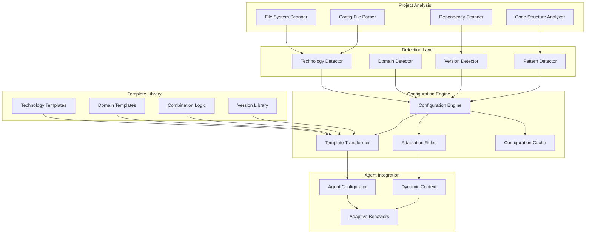

# Project-Specific Agent Configuration System

## Executive Summary

This document defines a dynamic agent configuration system that automatically detects project characteristics and adapts agent behavior accordingly. The system eliminates hardcoded technology assumptions, enables context-aware specialization, and provides intelligent agent customization based on project technology stack, domain, and specific requirements.

## Problem Statement

### Current Configuration Limitations

1. **Hardcoded Technology Assumptions**: Agents assume specific frameworks or languages
2. **Static Agent Behavior**: No adaptation to project-specific patterns or conventions
3. **Manual Configuration Overhead**: Requires manual setup for each project type
4. **Inconsistent Adaptation**: Different agents adapt differently to same technology
5. **Version Incompatibility**: No handling of different framework/library versions
6. **Domain Blindness**: Generic behavior regardless of business domain (healthcare, finance, etc.)
7. **Context Loss**: Technology decisions made independently by each agent

### System Requirements

- **Automatic Detection**: Identify technology stack, frameworks, domain, and patterns
- **Dynamic Adaptation**: Modify agent behavior based on project characteristics
- **Consistent Configuration**: Ensure all agents work with same technology understanding
- **Version Awareness**: Handle different versions of frameworks and libraries
- **Domain Specialization**: Adapt to industry-specific requirements and constraints
- **Configuration Caching**: Avoid re-detection for similar projects
- **Extensible Templates**: Easy addition of new technology stacks and domains

## Architecture Overview

### System Components



### Core Functionality

1. **Project Analysis**: Comprehensive scanning of project structure, dependencies, and patterns
2. **Technology Detection**: Intelligent identification of frameworks, languages, and tools
3. **Configuration Generation**: Dynamic creation of agent-specific configurations
4. **Template Management**: Extensible library of technology and domain templates
5. **Agent Adaptation**: Real-time modification of agent behavior and prompts
6. **Context Propagation**: Sharing configuration across all agents in workflow

## Technology Detection Engine

### Multi-Layer Detection Strategy

```typescript
interface ProjectProfile {
  project_id: string
  detected_at: string
  confidence_score: number
  
  // Technology stack
  primary_language: DetectedLanguage
  secondary_languages: DetectedLanguage[]
  frameworks: DetectedFramework[]
  libraries: DetectedLibrary[]
  tools: DetectedTool[]
  
  // Project characteristics
  project_type: 'web_app' | 'api' | 'mobile_app' | 'desktop' | 'library' | 'cli' | 'microservice'
  architecture_pattern: 'monolith' | 'microservice' | 'serverless' | 'jamstack' | 'spa' | 'mpa'
  deployment_target: 'cloud' | 'on_premise' | 'hybrid' | 'edge'
  
  // Domain context
  business_domain: DetectedDomain
  compliance_requirements: string[]
  data_sensitivity: 'public' | 'internal' | 'confidential' | 'restricted'
  
  // Development patterns
  testing_framework: DetectedFramework[]
  build_system: DetectedTool[]
  package_manager: DetectedTool
  version_control: DetectedTool
  ci_cd_platform: DetectedTool[]
  
  // Quality indicators
  code_quality_tools: DetectedTool[]
  security_tools: DetectedTool[]
  monitoring_tools: DetectedTool[]
}

interface DetectedLanguage {
  name: string
  version: string
  confidence: number
  evidence: DetectionEvidence[]
  usage_percentage: number
}

interface DetectedFramework {
  name: string
  version: string
  category: 'frontend' | 'backend' | 'testing' | 'build' | 'deployment'
  confidence: number
  evidence: DetectionEvidence[]
}

class TechnologyDetector {
  private detectors: Map<string, LanguageDetector>
  private patterns: DetectionPattern[]
  private confidence_threshold: number = 0.7
  
  async analyzeProject(project_path: string): Promise<ProjectProfile> {
    console.log(`[TechDetector] Analyzing project at ${project_path}`)
    
    // Phase 1: File system analysis
    const file_analysis = await this.analyzeFileSystem(project_path)
    
    // Phase 2: Configuration file parsing
    const config_analysis = await this.parseConfigurationFiles(project_path, file_analysis)
    
    // Phase 3: Dependency analysis
    const dependency_analysis = await this.analyzeDependencies(project_path, config_analysis)
    
    // Phase 4: Code structure analysis
    const structure_analysis = await this.analyzeCodeStructure(project_path, file_analysis)
    
    // Phase 5: Pattern detection
    const pattern_analysis = await this.detectPatterns(project_path, structure_analysis)
    
    // Phase 6: Domain detection
    const domain_analysis = await this.detectDomain(project_path, file_analysis, dependency_analysis)
    
    // Synthesize results
    const profile = await this.synthesizeProfile({
      file_analysis,
      config_analysis,
      dependency_analysis,
      structure_analysis,
      pattern_analysis,
      domain_analysis
    })
    
    console.log(`[TechDetector] Detected: ${profile.primary_language.name} with ${profile.frameworks.map(f => f.name).join(', ')}`)
    
    return profile
  }
  
  private async analyzeFileSystem(project_path: string): Promise<FileSystemAnalysis> {
    const file_extensions = new Map<string, number>()
    const directory_structure = new Map<string, number>()
    const special_files = new Set<string>()
    
    const scan_directory = async (dir_path: string, depth: number = 0): Promise<void> => {
      if (depth > 3) return // Limit scan depth
      
      try {
        const entries = await fs.readdir(dir_path, { withFileTypes: true })
        
        for (const entry of entries) {
          const full_path = path.join(dir_path, entry.name)
          
          if (entry.isDirectory()) {
            // Track directory patterns
            directory_structure.set(entry.name, (directory_structure.get(entry.name) || 0) + 1)
            
            // Don't scan certain directories
            if (!['node_modules', '.git', 'dist', 'build', '__pycache__'].includes(entry.name)) {
              await scan_directory(full_path, depth + 1)
            }
          } else {
            // Track file extensions
            const ext = path.extname(entry.name).toLowerCase()
            if (ext) {
              file_extensions.set(ext, (file_extensions.get(ext) || 0) + 1)
            }
            
            // Identify special files
            if (this.isSpecialFile(entry.name)) {
              special_files.add(entry.name)
            }
          }
        }
      } catch (error) {
        console.warn(`[TechDetector] Error scanning ${dir_path}: ${error.message}`)
      }
    }
    
    await scan_directory(project_path)
    
    return {
      file_extensions: Array.from(file_extensions.entries()).sort((a, b) => b[1] - a[1]),
      directory_structure: Array.from(directory_structure.entries()),
      special_files: Array.from(special_files),
      total_files: Array.from(file_extensions.values()).reduce((sum, count) => sum + count, 0)
    }
  }
  
  private async parseConfigurationFiles(
    project_path: string, 
    file_analysis: FileSystemAnalysis
  ): Promise<ConfigurationAnalysis> {
    const config_parsers = new Map<string, ConfigParser>()
    config_parsers.set('package.json', new PackageJsonParser())
    config_parsers.set('requirements.txt', new RequirementsParser())
    config_parsers.set('Cargo.toml', new CargoTomlParser())
    config_parsers.set('pom.xml', new PomXmlParser())
    config_parsers.set('go.mod', new GoModParser())
    config_parsers.set('composer.json', new ComposerJsonParser())
    config_parsers.set('Dockerfile', new DockerfileParser())
    config_parsers.set('.env', new EnvFileParser())
    
    const parsed_configurations = new Map<string, any>()
    
    for (const special_file of file_analysis.special_files) {
      const parser = config_parsers.get(special_file)
      if (parser) {
        try {
          const file_path = path.join(project_path, special_file)
          const parsed = await parser.parse(file_path)
          parsed_configurations.set(special_file, parsed)
        } catch (error) {
          console.warn(`[TechDetector] Error parsing ${special_file}: ${error.message}`)
        }
      }
    }
    
    return {
      configurations: parsed_configurations,
      detected_frameworks: this.extractFrameworksFromConfigs(parsed_configurations),
      detected_dependencies: this.extractDependenciesFromConfigs(parsed_configurations),
      build_tools: this.extractBuildToolsFromConfigs(parsed_configurations),
      environment_variables: this.extractEnvVarsFromConfigs(parsed_configurations)
    }
  }
  
  private async detectPatterns(
    project_path: string,
    structure_analysis: StructureAnalysis
  ): Promise<PatternAnalysis> {
    const detected_patterns = new Set<string>()
    const architecture_indicators = new Map<string, number>()
    
    // MVC Pattern Detection
    if (this.hasMVCStructure(structure_analysis)) {
      detected_patterns.add('mvc')
      architecture_indicators.set('mvc', 0.8)
    }
    
    // Microservice Pattern Detection
    if (this.hasMicroserviceStructure(structure_analysis)) {
      detected_patterns.add('microservice')
      architecture_indicators.set('microservice', 0.9)
    }
    
    // Domain-Driven Design Detection
    if (this.hasDDDStructure(structure_analysis)) {
      detected_patterns.add('domain_driven_design')
      architecture_indicators.set('ddd', 0.7)
    }
    
    // Repository Pattern Detection
    if (this.hasRepositoryPattern(structure_analysis)) {
      detected_patterns.add('repository_pattern')
    }
    
    // Factory Pattern Detection
    if (this.hasFactoryPattern(structure_analysis)) {
      detected_patterns.add('factory_pattern')
    }
    
    return {
      detected_patterns: Array.from(detected_patterns),
      architecture_indicators: Array.from(architecture_indicators.entries()),
      confidence_scores: this.calculatePatternConfidence(detected_patterns, structure_analysis)
    }
  }
  
  private async detectDomain(
    project_path: string,
    file_analysis: FileSystemAnalysis,
    dependency_analysis: DependencyAnalysis
  ): Promise<DomainAnalysis> {
    const domain_indicators = new Map<string, number>()
    
    // Healthcare domain indicators
    const healthcare_keywords = ['patient', 'medical', 'health', 'clinical', 'hipaa', 'fhir', 'ehr']
    if (this.hasKeywordIndicators(file_analysis, healthcare_keywords) ||
        this.hasHealthcareDependencies(dependency_analysis)) {
      domain_indicators.set('healthcare', 0.8)
    }
    
    // Financial domain indicators
    const finance_keywords = ['payment', 'transaction', 'banking', 'finance', 'pci', 'stripe', 'paypal']
    if (this.hasKeywordIndicators(file_analysis, finance_keywords) ||
        this.hasFinancialDependencies(dependency_analysis)) {
      domain_indicators.set('finance', 0.8)
    }
    
    // E-commerce domain indicators
    const ecommerce_keywords = ['cart', 'product', 'order', 'inventory', 'shipping', 'checkout']
    if (this.hasKeywordIndicators(file_analysis, ecommerce_keywords) ||
        this.hasEcommerceDependencies(dependency_analysis)) {
      domain_indicators.set('ecommerce', 0.7)
    }
    
    // Education domain indicators
    const education_keywords = ['student', 'course', 'lesson', 'grade', 'assignment', 'ferpa']
    if (this.hasKeywordIndicators(file_analysis, education_keywords)) {
      domain_indicators.set('education', 0.6)
    }
    
    // Default to general if no specific domain detected
    if (domain_indicators.size === 0) {
      domain_indicators.set('general', 0.5)
    }
    
    // Determine primary domain
    const primary_domain = Array.from(domain_indicators.entries())
      .sort((a, b) => b[1] - a[1])[0]
    
    return {
      primary_domain: primary_domain[0],
      confidence: primary_domain[1],
      all_indicators: Array.from(domain_indicators.entries()),
      compliance_requirements: this.inferComplianceRequirements(primary_domain[0]),
      data_sensitivity_level: this.inferDataSensitivity(primary_domain[0])
    }
  }
}
```

## Configuration Template System

### Template Structure and Management

```typescript
interface ConfigurationTemplate {
  template_id: string
  name: string
  description: string
  version: string
  
  // Applicability conditions
  applies_to: ApplicabilityCondition[]
  priority: number
  
  // Agent modifications
  agent_modifications: Map<string, AgentModification>
  
  // Global settings
  global_settings: GlobalConfiguration
  
  // Context enhancements
  context_additions: ContextAddition[]
  
  // Validation rules
  validation_overrides: ValidationOverride[]
}

interface AgentModification {
  agent_name: string
  modifications: {
    // Prompt modifications
    prompt_additions?: string[]
    prompt_replacements?: Map<string, string>
    
    // Research query modifications
    research_query_templates?: string[]
    context7_specializations?: string[]
    
    // Success criteria modifications
    additional_success_criteria?: string[]
    modified_quality_gates?: QualityGate[]
    
    // Tool usage modifications
    preferred_tools?: string[]
    tool_configurations?: Map<string, any>
    
    // Output format modifications
    output_template_overrides?: string
    additional_sections?: string[]
    
    // Error handling modifications
    specialized_error_patterns?: ErrorPattern[]
    escalation_overrides?: EscalationOverride[]
  }
}

class ConfigurationTemplateManager {
  private templates: Map<string, ConfigurationTemplate>
  private combination_rules: CombinationRule[]
  
  constructor() {
    this.loadBuiltInTemplates()
    this.loadCombinationRules()
  }
  
  async generateConfiguration(profile: ProjectProfile): Promise<AgentConfiguration> {
    console.log(`[ConfigManager] Generating configuration for ${profile.primary_language.name} project`)
    
    // Find applicable templates
    const applicable_templates = this.findApplicableTemplates(profile)
    
    // Combine templates based on priority and combination rules
    const combined_template = await this.combineTemplates(applicable_templates, profile)
    
    // Generate agent-specific configurations
    const agent_configurations = new Map<string, AgentSpecificConfig>()
    
    for (const [agent_name, modification] of combined_template.agent_modifications) {
      agent_configurations.set(agent_name, await this.generateAgentConfig(
        agent_name,
        modification,
        profile,
        combined_template.global_settings
      ))
    }
    
    return {
      configuration_id: uuidv4(),
      project_profile: profile,
      template_combination: combined_template,
      agent_configurations,
      global_context: this.generateGlobalContext(profile, combined_template),
      validation_rules: this.generateValidationRules(profile, combined_template)
    }
  }
  
  private async generateAgentConfig(
    agent_name: string,
    modification: AgentModification,
    profile: ProjectProfile,
    global_settings: GlobalConfiguration
  ): Promise<AgentSpecificConfig> {
    
    // Load base agent configuration
    const base_config = await this.loadBaseAgentConfig(agent_name)
    
    // Apply technology-specific modifications
    const modified_config = this.applyModifications(base_config, modification)
    
    // Add project-specific context
    const contextual_config = this.addProjectContext(modified_config, profile)
    
    // Generate dynamic research queries
    const research_queries = this.generateResearchQueries(
      agent_name,
      profile,
      modification.modifications.research_query_templates || []
    )
    
    // Generate technology adaptation rules
    const adaptation_rules = this.generateAdaptationRules(agent_name, profile)
    
    return {
      agent_name,
      base_config,
      modified_prompt: contextual_config.prompt,
      research_queries,
      adaptation_rules,
      success_criteria: contextual_config.success_criteria,
      quality_gates: contextual_config.quality_gates,
      error_handling: contextual_config.error_handling,
      tool_configurations: contextual_config.tool_configurations
    }
  }
  
  private generateResearchQueries(
    agent_name: string,
    profile: ProjectProfile,
    query_templates: string[]
  ): ResearchQuery[] {
    const queries: ResearchQuery[] = []
    
    // Technology-specific queries
    for (const framework of profile.frameworks) {
      queries.push({
        type: 'context7',
        query: `${agent_name.replace('-', ' ')} best practices ${new Date().getFullYear()} ${framework.name} ${profile.primary_language.name}`,
        priority: 'high',
        fallback_query: `modern ${agent_name.replace('-', ' ')} practices ${new Date().getFullYear()} ${framework.name}`
      })
    }
    
    // Domain-specific queries
    if (profile.business_domain.primary_domain !== 'general') {
      queries.push({
        type: 'context7',
        query: `${profile.business_domain.primary_domain} ${agent_name.replace('-', ' ')} requirements patterns best practices`,
        priority: 'medium',
        fallback_query: `${profile.business_domain.primary_domain} software development practices`
      })
    }
    
    // Custom query templates
    for (const template of query_templates) {
      queries.push({
        type: 'context7',
        query: this.interpolateQueryTemplate(template, profile),
        priority: 'medium',
        fallback_query: template
      })
    }
    
    return queries
  }
  
  private loadBuiltInTemplates(): void {
    // React + TypeScript Template
    this.templates.set('react-typescript', {
      template_id: 'react-typescript',
      name: 'React TypeScript Web Application',
      description: 'Configuration for React applications with TypeScript',
      version: '2.0',
      applies_to: [{
        conditions: [
          { type: 'framework', name: 'react', min_confidence: 0.8 },
          { type: 'language', name: 'typescript', min_confidence: 0.7 }
        ],
        operator: 'AND'
      }],
      priority: 8,
      agent_modifications: new Map([
        ['requirements-analyst', {
          agent_name: 'requirements-analyst',
          modifications: {
            additional_success_criteria: [
              'User stories include component interaction patterns',
              'State management requirements clearly defined',
              'Accessibility requirements specified for UI components'
            ],
            research_query_templates: [
              'React user story patterns component design best practices',
              'TypeScript interface design user requirements patterns'
            ]
          }
        }],
        ['frontend-specialist', {
          agent_name: 'frontend-specialist',
          modifications: {
            prompt_additions: [
              'Use React functional components with hooks patterns',
              'Implement TypeScript strict mode with proper interface definitions',
              'Follow React Testing Library patterns for component testing',
              'Use React Router for navigation if multi-page application'
            ],
            preferred_tools: ['React Testing Library', 'Jest', 'Storybook', 'ESLint'],
            research_query_templates: [
              'React TypeScript best practices ${current_year} hooks patterns',
              'React component testing patterns TypeScript Jest'
            ]
          }
        }],
        ['lead-developer', {
          agent_name: 'lead-developer',
          modifications: {
            prompt_additions: [
              'Set up React development environment with TypeScript configuration',
              'Configure Jest and React Testing Library for TDD cycles',
              'Establish component interface contracts between frontend and backend'
            ],
            tool_configurations: {
              'testing_framework': 'jest',
              'type_checker': 'typescript',
              'linter': 'eslint'
            }
          }
        }]
      ]),
      global_settings: {
        testing_approach: 'component_driven_tdd',
        code_style: 'typescript_strict',
        build_system: 'vite_or_webpack',
        package_manager: 'npm_or_yarn'
      },
      context_additions: [{
        section: 'technology_context',
        content: {
          component_patterns: 'React functional components with hooks',
          state_management: 'Context API or Redux Toolkit',
          styling_approach: 'CSS modules or styled-components',
          build_tooling: 'Vite or Create React App'
        }
      }],
      validation_overrides: [{
        agent: 'frontend-specialist',
        rule: 'component_testability',
        condition: 'All React components must have corresponding test files'
      }]
    })
    
    // Python Django Template
    this.templates.set('python-django', {
      template_id: 'python-django',
      name: 'Python Django Web Framework',
      description: 'Configuration for Django backend applications',
      version: '2.0',
      applies_to: [{
        conditions: [
          { type: 'framework', name: 'django', min_confidence: 0.8 },
          { type: 'language', name: 'python', min_confidence: 0.9 }
        ],
        operator: 'AND'
      }],
      priority: 8,
      agent_modifications: new Map([
        ['backend-specialist', {
          agent_name: 'backend-specialist',
          modifications: {
            prompt_additions: [
              'Follow Django project structure with apps for logical separation',
              'Use Django ORM with proper model relationships and migrations',
              'Implement Django REST Framework for API endpoints',
              'Follow Django security best practices with CSRF protection'
            ],
            research_query_templates: [
              'Django best practices ${current_year} REST API design patterns',
              'Django ORM optimization query patterns performance'
            ],
            preferred_tools: ['Django', 'Django REST Framework', 'pytest-django', 'Black']
          }
        }],
        ['database-specialist', {
          agent_name: 'database-specialist',
          modifications: {
            prompt_additions: [
              'Design Django models with proper field types and relationships',
              'Plan Django migrations strategy for schema changes',
              'Consider Django-specific database optimization patterns'
            ],
            research_query_templates: [
              'Django model design best practices database optimization',
              'Django migrations strategy large scale applications'
            ]
          }
        }],
        ['security-specialist', {
          agent_name: 'security-specialist',
          modifications: {
            prompt_additions: [
              'Apply Django security middleware and settings',
              'Configure Django authentication and authorization properly',
              'Implement Django CSRF protection and secure cookies'
            ],
            additional_success_criteria: [
              'Django security settings configured according to deployment checklist',
              'Authentication backend properly configured for user management',
              'OWASP security controls implemented using Django built-in features'
            ]
          }
        }]
      ]),
      global_settings: {
        testing_approach: 'django_test_driven',
        code_style: 'black_isort_flake8',
        database_orm: 'django_orm',
        api_framework: 'django_rest_framework'
      },
      context_additions: [{
        section: 'framework_context',
        content: {
          project_structure: 'Django apps with MVT pattern',
          database_layer: 'Django ORM with migrations',
          api_design: 'Django REST Framework with serializers',
          authentication: 'Django built-in auth or custom user model'
        }
      }],
      validation_overrides: [{
        agent: 'backend-specialist',
        rule: 'django_best_practices',
        condition: 'All Django apps must have proper URLs, views, and model organization'
      }]
    })
    
    // Add more templates for other common stacks...
    this.loadAdditionalTemplates()
  }
}
```

## Dynamic Agent Adaptation

### Real-Time Configuration Application

```typescript
class AgentConfigurator {
  private configuration: AgentConfiguration
  private context_manager: ContextManager
  private template_cache: Map<string, ProcessedTemplate> = new Map()
  
  async configureAgent(
    agent_name: string,
    base_prompt: string,
    project_configuration: AgentConfiguration
  ): Promise<ConfiguredAgent> {
    
    console.log(`[AgentConfigurator] Configuring ${agent_name} for ${project_configuration.project_profile.primary_language.name}`)
    
    const agent_config = project_configuration.agent_configurations.get(agent_name)
    if (!agent_config) {
      console.warn(`[AgentConfigurator] No specific configuration found for ${agent_name}, using base configuration`)
      return this.createBaseConfiguredAgent(agent_name, base_prompt, project_configuration.global_context)
    }
    
    // Apply configuration modifications to base prompt
    const configured_prompt = await this.applyPromptModifications(
      base_prompt,
      agent_config,
      project_configuration.global_context
    )
    
    // Generate technology-specific context
    const technology_context = await this.generateTechnologyContext(
      agent_name,
      project_configuration.project_profile
    )
    
    // Create adaptive behaviors
    const adaptive_behaviors = await this.createAdaptiveBehaviors(
      agent_name,
      agent_config,
      project_configuration.project_profile
    )
    
    return {
      agent_name,
      original_prompt: base_prompt,
      configured_prompt,
      technology_context,
      adaptive_behaviors,
      research_queries: agent_config.research_queries,
      quality_gates: agent_config.quality_gates,
      tool_configurations: agent_config.tool_configurations,
      validation_rules: this.generateAgentValidationRules(agent_name, project_configuration)
    }
  }
  
  private async applyPromptModifications(
    base_prompt: string,
    agent_config: AgentSpecificConfig,
    global_context: GlobalContext
  ): Promise<string> {
    
    let modified_prompt = base_prompt
    
    // Apply prompt additions
    if (agent_config.modified_prompt.prompt_additions) {
      const additions_section = this.formatPromptAdditions(agent_config.modified_prompt.prompt_additions)
      modified_prompt = this.insertIntoPromptSection(modified_prompt, 'Research & Methodology', additions_section)
    }
    
    // Apply prompt replacements
    if (agent_config.modified_prompt.prompt_replacements) {
      for (const [search, replace] of agent_config.modified_prompt.prompt_replacements) {
        modified_prompt = modified_prompt.replace(new RegExp(search, 'g'), replace)
      }
    }
    
    // Interpolate technology-specific variables
    modified_prompt = this.interpolateTechnologyVariables(modified_prompt, global_context)
    
    // Add technology-specific success criteria
    if (agent_config.success_criteria) {
      modified_prompt = this.enhanceSuccessCriteria(modified_prompt, agent_config.success_criteria)
    }
    
    return modified_prompt
  }
  
  private async generateTechnologyContext(
    agent_name: string,
    project_profile: ProjectProfile
  ): Promise<TechnologyContext> {
    
    return {
      // Language-specific context
      primary_language: {
        name: project_profile.primary_language.name,
        version: project_profile.primary_language.version,
        common_patterns: await this.getLanguagePatterns(project_profile.primary_language.name),
        testing_frameworks: await this.getTestingFrameworks(project_profile.primary_language.name),
        linting_tools: await this.getLintingTools(project_profile.primary_language.name)
      },
      
      // Framework-specific context
      frameworks: project_profile.frameworks.map(framework => ({
        name: framework.name,
        version: framework.version,
        specific_patterns: this.getFrameworkPatterns(framework.name),
        best_practices: this.getFrameworkBestPractices(framework.name),
        common_pitfalls: this.getFrameworkPitfalls(framework.name)
      })),
      
      // Domain-specific context
      domain_context: {
        primary_domain: project_profile.business_domain.primary_domain,
        compliance_requirements: project_profile.business_domain.compliance_requirements,
        security_considerations: await this.getDomainSecurityRequirements(project_profile.business_domain),
        common_patterns: await this.getDomainPatterns(project_profile.business_domain)
      },
      
      // Project-specific context
      project_context: {
        architecture_pattern: project_profile.architecture_pattern,
        deployment_target: project_profile.deployment_target,
        build_system: project_profile.build_system.map(tool => tool.name),
        testing_approach: this.determineTestingApproach(project_profile)
      }
    }
  }
  
  private async createAdaptiveBehaviors(
    agent_name: string,
    agent_config: AgentSpecificConfig,
    project_profile: ProjectProfile
  ): Promise<AdaptiveBehavior[]> {
    
    const behaviors: AdaptiveBehavior[] = []
    
    // Research query adaptation
    behaviors.push({
      trigger: 'before_research',
      behavior: async (context) => {
        const adapted_queries = this.adaptResearchQueries(
          agent_config.research_queries,
          project_profile,
          context
        )
        return { research_queries: adapted_queries }
      }
    })
    
    // Output format adaptation
    behaviors.push({
      trigger: 'before_output_generation',
      behavior: async (context) => {
        const adapted_format = this.adaptOutputFormat(
          agent_name,
          project_profile,
          context
        )
        return { output_format: adapted_format }
      }
    })
    
    // Validation rule adaptation
    behaviors.push({
      trigger: 'before_validation',
      behavior: async (context) => {
        const adapted_rules = this.adaptValidationRules(
          agent_config.quality_gates,
          project_profile,
          context
        )
        return { validation_rules: adapted_rules }
      }
    })
    
    // Error handling adaptation
    behaviors.push({
      trigger: 'on_error',
      behavior: async (error, context) => {
        const adapted_handling = this.adaptErrorHandling(
          error,
          project_profile,
          agent_config.error_handling,
          context
        )
        return { error_handling: adapted_handling }
      }
    })
    
    return behaviors
  }
  
  private adaptResearchQueries(
    base_queries: ResearchQuery[],
    project_profile: ProjectProfile,
    execution_context: ExecutionContext
  ): ResearchQuery[] {
    
    return base_queries.map(query => {
      let adapted_query = query.query
      
      // Replace technology placeholders
      adapted_query = adapted_query.replace(/\$\{primary_language\}/g, project_profile.primary_language.name)
      adapted_query = adapted_query.replace(/\$\{framework\}/g, 
        project_profile.frameworks.map(f => f.name).join(' '))
      adapted_query = adapted_query.replace(/\$\{domain\}/g, project_profile.business_domain.primary_domain)
      adapted_query = adapted_query.replace(/\$\{current_year\}/g, new Date().getFullYear().toString())
      
      // Add version-specific information if relevant
      if (project_profile.frameworks.length > 0) {
        const main_framework = project_profile.frameworks[0]
        if (main_framework.version) {
          adapted_query += ` version ${main_framework.version}`
        }
      }
      
      return {
        ...query,
        query: adapted_query,
        context_additions: {
          technology_stack: project_profile.frameworks.map(f => f.name),
          domain: project_profile.business_domain.primary_domain,
          project_type: project_profile.project_type
        }
      }
    })
  }
}
```

## Configuration Caching and Performance

### Intelligent Caching System

```typescript
interface ConfigurationCache {
  cache_key: string
  project_signature: string
  configuration: AgentConfiguration
  created_at: string
  last_used: string
  hit_count: number
  confidence_score: number
}

class ConfigurationCacheManager {
  private cache: Map<string, ConfigurationCache> = new Map()
  private similarity_threshold: number = 0.85
  private max_cache_size: number = 100
  private cache_ttl_hours: number = 24
  
  async getCachedConfiguration(project_profile: ProjectProfile): Promise<AgentConfiguration | null> {
    const project_signature = this.generateProjectSignature(project_profile)
    
    // Check for exact match first
    const exact_match = this.cache.get(project_signature)
    if (exact_match && this.isCacheValid(exact_match)) {
      exact_match.hit_count++
      exact_match.last_used = new Date().toISOString()
      console.log(`[ConfigCache] Exact cache hit for ${project_signature}`)
      return exact_match.configuration
    }
    
    // Look for similar configurations
    const similar_config = await this.findSimilarConfiguration(project_profile)
    if (similar_config) {
      console.log(`[ConfigCache] Similar cache hit for ${project_signature} (similarity: ${similar_config.confidence_score})`)
      
      // Adapt similar configuration to current project
      const adapted_config = await this.adaptSimilarConfiguration(
        similar_config.configuration,
        project_profile
      )
      
      // Cache the adapted configuration
      await this.cacheConfiguration(project_signature, adapted_config, project_profile)
      
      return adapted_config
    }
    
    return null
  }
  
  async cacheConfiguration(
    project_signature: string,
    configuration: AgentConfiguration,
    project_profile: ProjectProfile
  ): Promise<void> {
    
    // Ensure cache size limits
    if (this.cache.size >= this.max_cache_size) {
      await this.evictOldestEntries()
    }
    
    const cache_entry: ConfigurationCache = {
      cache_key: project_signature,
      project_signature,
      configuration,
      created_at: new Date().toISOString(),
      last_used: new Date().toISOString(),
      hit_count: 0,
      confidence_score: this.calculateConfigurationConfidence(configuration, project_profile)
    }
    
    this.cache.set(project_signature, cache_entry)
    console.log(`[ConfigCache] Cached configuration for ${project_signature}`)
  }
  
  private generateProjectSignature(project_profile: ProjectProfile): string {
    // Create a signature that captures the essential characteristics
    const signature_components = [
      project_profile.primary_language.name,
      project_profile.primary_language.version?.split('.')[0] || 'unknown', // Major version only
      project_profile.frameworks.map(f => `${f.name}:${f.version?.split('.')[0] || 'unknown'}`).sort().join(','),
      project_profile.project_type,
      project_profile.architecture_pattern,
      project_profile.business_domain.primary_domain
    ]
    
    return crypto.createHash('sha256')
      .update(signature_components.join('|'))
      .digest('hex')
      .substring(0, 16)
  }
  
  private async findSimilarConfiguration(project_profile: ProjectProfile): Promise<ConfigurationCache | null> {
    let best_match: ConfigurationCache | null = null
    let best_similarity = 0
    
    for (const cached_config of this.cache.values()) {
      if (!this.isCacheValid(cached_config)) continue
      
      const similarity = this.calculateProjectSimilarity(
        project_profile,
        cached_config.configuration.project_profile
      )
      
      if (similarity > best_similarity && similarity >= this.similarity_threshold) {
        best_similarity = similarity
        best_match = cached_config
      }
    }
    
    if (best_match) {
      best_match.confidence_score = best_similarity
    }
    
    return best_match
  }
  
  private calculateProjectSimilarity(profile1: ProjectProfile, profile2: ProjectProfile): number {
    let similarity_score = 0
    let weight_sum = 0
    
    // Language similarity (high weight)
    const language_weight = 0.3
    if (profile1.primary_language.name === profile2.primary_language.name) {
      similarity_score += language_weight
    }
    weight_sum += language_weight
    
    // Framework similarity (high weight)
    const framework_weight = 0.25
    const framework_overlap = this.calculateFrameworkOverlap(profile1.frameworks, profile2.frameworks)
    similarity_score += framework_weight * framework_overlap
    weight_sum += framework_weight
    
    // Project type similarity (medium weight)
    const project_type_weight = 0.15
    if (profile1.project_type === profile2.project_type) {
      similarity_score += project_type_weight
    }
    weight_sum += project_type_weight
    
    // Architecture pattern similarity (medium weight)
    const architecture_weight = 0.15
    if (profile1.architecture_pattern === profile2.architecture_pattern) {
      similarity_score += architecture_weight
    }
    weight_sum += architecture_weight
    
    // Domain similarity (low weight)
    const domain_weight = 0.1
    if (profile1.business_domain.primary_domain === profile2.business_domain.primary_domain) {
      similarity_score += domain_weight
    }
    weight_sum += domain_weight
    
    // Build system similarity (low weight)
    const build_weight = 0.05
    const build_overlap = this.calculateToolOverlap(profile1.build_system, profile2.build_system)
    similarity_score += build_weight * build_overlap
    weight_sum += build_weight
    
    return weight_sum > 0 ? similarity_score / weight_sum : 0
  }
  
  private async adaptSimilarConfiguration(
    base_config: AgentConfiguration,
    target_profile: ProjectProfile
  ): Promise<AgentConfiguration> {
    
    // Clone the base configuration
    const adapted_config = JSON.parse(JSON.stringify(base_config)) as AgentConfiguration
    
    // Update project profile
    adapted_config.project_profile = target_profile
    
    // Re-generate technology-specific contexts for each agent
    for (const [agent_name, agent_config] of adapted_config.agent_configurations) {
      // Update research queries with new technology stack
      agent_config.research_queries = this.adaptResearchQueriesForProfile(
        agent_config.research_queries,
        target_profile
      )
      
      // Update technology context
      agent_config.technology_context = await this.generateTechnologyContextForProfile(
        agent_name,
        target_profile
      )
      
      // Update validation rules if needed
      if (this.requiresValidationUpdates(base_config.project_profile, target_profile)) {
        agent_config.quality_gates = this.adaptQualityGatesForProfile(
          agent_config.quality_gates,
          target_profile
        )
      }
    }
    
    // Update global context
    adapted_config.global_context = this.generateGlobalContextForProfile(target_profile)
    
    return adapted_config
  }
}
```

## Implementation Roadmap

### Phase 1: Core Detection and Templates (Week 1-2)
1. **Technology Detection Engine**
   - File system analysis implementation
   - Configuration file parsers for major stacks
   - Basic pattern recognition

2. **Template System Foundation**
   - Template structure definition
   - Built-in templates for common stacks (React, Django, Express, etc.)
   - Template combination logic

3. **Basic Agent Configuration**
   - Simple prompt modification system
   - Technology context generation
   - Research query adaptation

### Phase 2: Advanced Adaptation and Caching (Week 3-4)
1. **Dynamic Agent Adaptation**
   - Real-time configuration application
   - Adaptive behavior implementation
   - Context-aware specialization

2. **Configuration Caching**
   - Intelligent caching system
   - Similarity-based retrieval
   - Performance optimization

3. **Domain Detection**
   - Business domain identification
   - Compliance requirement inference
   - Industry-specific adaptations

### Phase 3: Integration and Optimization (Week 5-6)
1. **System Integration**
   - Context management integration
   - Workflow coordination integration
   - Validation protocol integration

2. **Advanced Templates**
   - Complex technology stack templates
   - Multi-framework configurations
   - Custom template creation tools

3. **Performance and Monitoring**
   - Configuration effectiveness tracking
   - Template usage analytics
   - Continuous improvement mechanisms

## Expected Benefits

### Immediate Benefits
1. **Automatic Adaptation**: Agents automatically adapt to project technology without manual configuration
2. **Consistent Behavior**: All agents use consistent understanding of project technology stack
3. **Reduced Setup Time**: Zero-configuration setup for most common technology stacks
4. **Better Quality**: Technology-specific best practices applied automatically

### Long-Term Benefits
1. **Extensible System**: Easy addition of new technology stacks and domains
2. **Learning Capability**: System learns from successful configurations and improves over time
3. **Reduced Maintenance**: Templates centralize technology-specific knowledge
4. **Scalable Specialization**: Supports specialized configurations for complex enterprise requirements

This project-specific agent configuration system eliminates the hardcoded technology assumptions anti-pattern and provides intelligent, adaptive agent behavior that scales with the diversity of software projects in the modern development landscape.