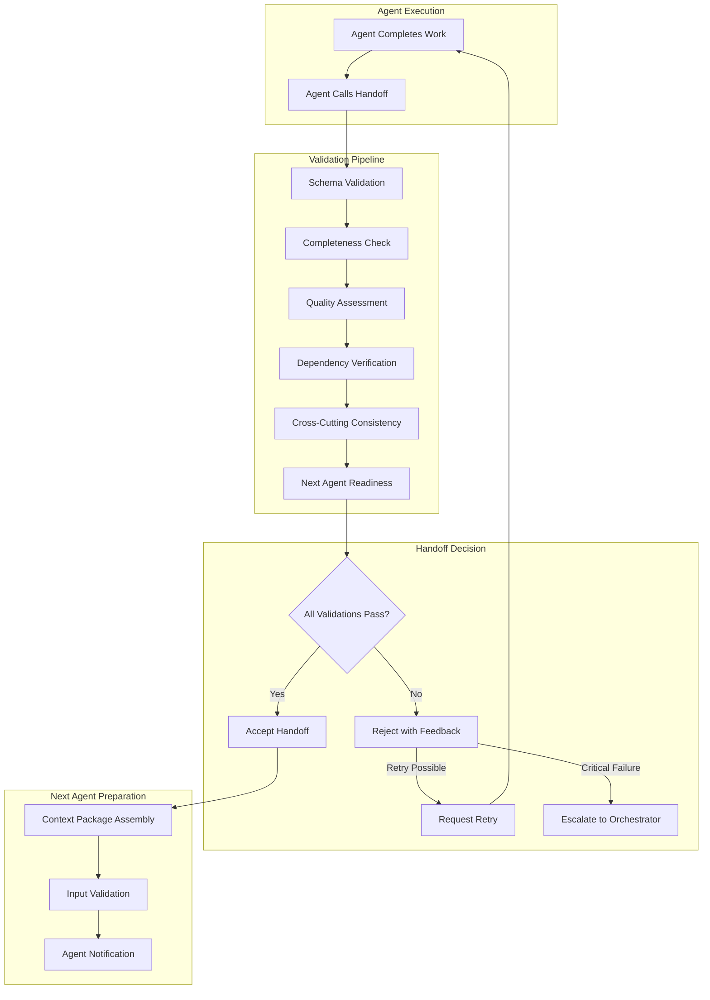

# Standardized Handoff Validation Protocols

## Executive Summary

This document defines comprehensive validation protocols for agent-to-agent handoffs in the multi-agent software development system. These protocols ensure quality gates are met, outputs are complete and properly formatted, and downstream agents receive validated inputs that enable successful task execution.

## Problem Statement

### Current Handoff Issues Identified

1. **Inconsistent Output Quality**: Agents produce outputs in varying formats and completeness levels
2. **Missing Validation Gates**: No systematic verification that outputs meet downstream agent requirements
3. **Silent Failures**: Downstream agents fail or produce poor results due to inadequate inputs
4. **Context Loss**: Critical information lost between agent handoffs
5. **Manual Quality Assessment**: No automated quality checking before handoffs
6. **Dependency Validation Gaps**: No verification that prerequisites are properly met

### Requirements for Validation System

- **Automated Quality Gates**: Programmatic validation of agent outputs before handoff
- **Schema Enforcement**: Standardized output formats with validation
- **Dependency Verification**: Automated checking of prerequisite completeness
- **Quality Scoring**: Measurable quality metrics for handoff decisions
- **Error Recovery**: Retry mechanisms and escalation paths for failed validations
- **Audit Trail**: Complete tracking of validation results and handoff quality

## Architecture Overview

### Validation Pipeline Design



### Core Components

1. **Schema Validator**: Ensures outputs conform to standardized formats
2. **Completeness Checker**: Verifies all required sections and content present
3. **Quality Assessor**: Evaluates output quality against measurable criteria
4. **Dependency Verifier**: Confirms all prerequisites met for next agent
5. **Consistency Validator**: Checks alignment with cross-cutting concerns
6. **Readiness Evaluator**: Assesses next agent's ability to proceed

## Validation Schema Definitions

### Agent Output Schema Framework

```typescript
interface AgentOutput {
  agent_name: string
  agent_version: string
  execution_id: string
  timestamp: string
  
  // Core deliverables
  primary_deliverable: {
    file_path: string
    content_hash: string
    format_version: string
  }
  
  // Supporting outputs
  supporting_files: string[]
  
  // Validation metadata
  self_critique: {
    completed: boolean
    file_path: string
    quality_score: number
  }
  
  // Handoff information
  handoff_notes: {
    next_agent: string
    context_summary: string
    key_decisions: string[]
    outstanding_issues: string[]
    success_criteria_met: boolean[]
  }
  
  // Quality metrics
  quality_metrics: {
    completeness_score: number
    format_compliance: boolean
    research_depth: number
    adaptation_quality: number
  }
}

interface ValidationResult {
  overall_valid: boolean
  validation_score: number
  timestamp: string
  
  schema_validation: {
    valid: boolean
    errors: ValidationError[]
  }
  
  completeness_check: {
    valid: boolean
    missing_elements: string[]
    completion_percentage: number
  }
  
  quality_assessment: {
    valid: boolean
    quality_score: number
    quality_dimensions: QualityDimension[]
  }
  
  dependency_verification: {
    valid: boolean
    missing_dependencies: string[]
    prerequisite_satisfaction: PrerequisiteCheck[]
  }
  
  readiness_evaluation: {
    next_agent_ready: boolean
    blocking_issues: string[]
    recommended_actions: string[]
  }
}
```

### Agent-Specific Validation Schemas

#### Requirements Analyst Output Validation

```typescript
interface RequirementsAnalystValidation extends BaseValidation {
  user_story_quality: {
    invest_compliance: boolean
    acceptance_criteria_testability: number
    moscow_prioritization_complete: boolean
  }
  
  nfr_specification: {
    measurable_targets: boolean
    quantified_requirements_percentage: number
  }
  
  assumption_documentation: {
    assumptions_flagged: boolean
    validation_requirements_clear: boolean
  }
}

const REQUIREMENTS_VALIDATION_RULES = [
  {
    name: 'user_stories_invest_compliant',
    description: 'All user stories meet INVEST criteria',
    severity: 'error',
    check: (output) => {
      const stories = output.user_stories
      return stories.every(story => 
        story.independent && 
        story.negotiable && 
        story.valuable && 
        story.estimable && 
        story.small && 
        story.testable
      )
    }
  },
  
  {
    name: 'measurable_acceptance_criteria',
    description: 'All acceptance criteria are testable and measurable',
    severity: 'error',
    check: (output) => {
      const stories = output.user_stories
      const vagueTerms = ['user-friendly', 'intuitive', 'fast', 'secure']
      
      return stories.every(story =>
        story.acceptance_criteria.every(criteria =>
          !vagueTerms.some(term => criteria.toLowerCase().includes(term))
        )
      )
    }
  },
  
  {
    name: 'moscow_prioritization',
    description: 'All requirements prioritized using MoSCoW method',
    severity: 'error',
    check: (output) => {
      const validPriorities = ['Must Have', 'Should Have', 'Could Have', 'Won\'t Have']
      return output.user_stories.every(story =>
        validPriorities.includes(story.priority)
      )
    }
  }
]
```

#### Security Specialist Output Validation

```typescript
interface SecuritySpecialistValidation extends BaseValidation {
  threat_model_completeness: {
    methodology_applied: 'STRIDE' | 'PASTA' | 'OCTAVE'
    all_components_analyzed: boolean
    attack_vectors_documented: boolean
  }
  
  owasp_coverage: {
    top_10_addressed: boolean
    controls_specified: boolean
    implementation_clarity: number
  }
  
  compliance_mapping: {
    requirements_identified: boolean
    controls_mapped: boolean
    audit_ready: boolean
  }
}

const SECURITY_VALIDATION_RULES = [
  {
    name: 'owasp_top_10_coverage',
    description: 'All OWASP Top 10 vulnerabilities addressed with specific controls',
    severity: 'error',
    check: (output) => {
      const owasp_categories = [
        'injection', 'broken_authentication', 'sensitive_data_exposure',
        'xxe', 'broken_access_control', 'security_misconfiguration',
        'xss', 'insecure_deserialization', 'vulnerable_components',
        'insufficient_logging'
      ]
      
      return owasp_categories.every(category =>
        output.security_controls.some(control =>
          control.addresses_owasp.includes(category) &&
          control.implementation_specified
        )
      )
    }
  },
  
  {
    name: 'threat_model_methodology',
    description: 'Recognized threat modeling methodology applied systematically',
    severity: 'error',
    check: (output) => {
      const validMethodologies = ['STRIDE', 'PASTA', 'OCTAVE']
      return validMethodologies.includes(output.threat_model.methodology) &&
             output.threat_model.system_components_analyzed.length > 0
    }
  }
]
```

#### Lead Developer Output Validation

```typescript
interface LeadDeveloperValidation extends BaseValidation {
  tdd_compliance: {
    cycles_documented: boolean
    red_green_refactor_followed: boolean
    test_failure_verification: boolean
  }
  
  environment_setup: {
    complete: boolean
    testing_framework_configured: boolean
    quality_gates_defined: boolean
  }
  
  coordination_readiness: {
    frontend_handoff_clear: boolean
    backend_handoff_clear: boolean
    interface_contracts_defined: boolean
  }
}

const LEAD_DEVELOPER_VALIDATION_RULES = [
  {
    name: 'tdd_cycles_documented',
    description: 'All TDD cycles properly documented with actual test runs',
    severity: 'error',
    check: (output) => {
      return output.tdd_cycles.every(cycle =>
        cycle.red_phase.test_failed &&
        cycle.green_phase.test_passed &&
        cycle.refactor_phase.all_tests_still_pass
      )
    }
  },
  
  {
    name: 'handoff_completeness',
    description: 'Both frontend and backend specialists have clear handoff instructions',
    severity: 'error',
    check: (output) => {
      return output.handoff_notes.frontend_specialist &&
             output.handoff_notes.backend_specialist &&
             output.interface_contracts.length > 0
    }
  }
]
```

## Validation Pipeline Implementation

### Quality Assessment Engine

```typescript
class QualityAssessmentEngine {
  private validationRules: Map<string, ValidationRule[]>
  private qualityThresholds: QualityThresholds
  
  constructor() {
    this.loadValidationRules()
    this.loadQualityThresholds()
  }
  
  async validateAgentOutput(
    agent_name: string, 
    output: AgentOutput
  ): Promise<ValidationResult> {
    
    const results: ValidationResult = {
      overall_valid: false,
      validation_score: 0,
      timestamp: new Date().toISOString(),
      schema_validation: await this.validateSchema(agent_name, output),
      completeness_check: await this.checkCompleteness(agent_name, output),
      quality_assessment: await this.assessQuality(agent_name, output),
      dependency_verification: await this.verifyDependencies(agent_name, output),
      readiness_evaluation: await this.evaluateReadiness(agent_name, output)
    }
    
    // Calculate overall validation score
    results.validation_score = this.calculateValidationScore(results)
    results.overall_valid = results.validation_score >= this.qualityThresholds.minimum_pass_score
    
    return results
  }
  
  private async validateSchema(agent_name: string, output: AgentOutput): Promise<SchemaValidationResult> {
    const schema = this.getSchemaForAgent(agent_name)
    const validator = new JsonSchemaValidator(schema)
    
    try {
      const isValid = validator.validate(output)
      return {
        valid: isValid,
        errors: validator.getErrors()
      }
    } catch (error) {
      return {
        valid: false,
        errors: [{ message: `Schema validation failed: ${error.message}`, path: 'root' }]
      }
    }
  }
  
  private async checkCompleteness(agent_name: string, output: AgentOutput): Promise<CompletenessResult> {
    const requirements = this.getCompletenessRequirements(agent_name)
    const missing_elements: string[] = []
    
    for (const requirement of requirements) {
      if (!this.checkRequirementMet(output, requirement)) {
        missing_elements.push(requirement.name)
      }
    }
    
    const completion_percentage = 
      ((requirements.length - missing_elements.length) / requirements.length) * 100
    
    return {
      valid: missing_elements.length === 0,
      missing_elements,
      completion_percentage
    }
  }
  
  private async assessQuality(agent_name: string, output: AgentOutput): Promise<QualityAssessmentResult> {
    const rules = this.validationRules.get(agent_name) || []
    const quality_dimensions: QualityDimension[] = []
    
    for (const rule of rules) {
      try {
        const result = await rule.check(output)
        quality_dimensions.push({
          dimension: rule.name,
          score: result.score,
          weight: rule.weight,
          details: result.details
        })
      } catch (error) {
        quality_dimensions.push({
          dimension: rule.name,
          score: 0,
          weight: rule.weight,
          details: { error: error.message }
        })
      }
    }
    
    const weighted_score = quality_dimensions.reduce(
      (sum, dim) => sum + (dim.score * dim.weight), 0
    ) / quality_dimensions.reduce((sum, dim) => sum + dim.weight, 0)
    
    return {
      valid: weighted_score >= this.qualityThresholds.quality_minimum,
      quality_score: weighted_score,
      quality_dimensions
    }
  }
  
  private async verifyDependencies(agent_name: string, output: AgentOutput): Promise<DependencyVerificationResult> {
    const dependencies = this.getDependenciesForAgent(agent_name)
    const missing_dependencies: string[] = []
    const prerequisite_checks: PrerequisiteCheck[] = []
    
    for (const dependency of dependencies) {
      const check_result = await this.checkDependencySatisfied(dependency, output)
      prerequisite_checks.push(check_result)
      
      if (!check_result.satisfied) {
        missing_dependencies.push(dependency.name)
      }
    }
    
    return {
      valid: missing_dependencies.length === 0,
      missing_dependencies,
      prerequisite_satisfaction: prerequisite_checks
    }
  }
  
  private async evaluateReadiness(agent_name: string, output: AgentOutput): Promise<ReadinessEvaluationResult> {
    const next_agent = output.handoff_notes.next_agent
    const next_agent_requirements = this.getAgentRequirements(next_agent)
    
    const blocking_issues: string[] = []
    const recommended_actions: string[] = []
    
    // Check if output satisfies next agent's input requirements
    for (const requirement of next_agent_requirements.input_requirements) {
      if (!this.checkOutputSatisfiesRequirement(output, requirement)) {
        blocking_issues.push(`Missing requirement: ${requirement.name}`)
        recommended_actions.push(`Provide ${requirement.description}`)
      }
    }
    
    // Check for handoff note completeness
    if (!output.handoff_notes.context_summary) {
      blocking_issues.push('Missing context summary in handoff notes')
      recommended_actions.push('Add comprehensive context summary')
    }
    
    if (output.handoff_notes.key_decisions.length === 0) {
      blocking_issues.push('No key decisions documented')
      recommended_actions.push('Document key decisions made during execution')
    }
    
    return {
      next_agent_ready: blocking_issues.length === 0,
      blocking_issues,
      recommended_actions
    }
  }
}
```

### Automated Handoff Workflow

```typescript
class HandoffWorkflow {
  private validationEngine: QualityAssessmentEngine
  private contextManager: ContextManager
  private notificationService: NotificationService
  
  async processHandoff(
    from_agent: string,
    output: AgentOutput,
    context_id: string
  ): Promise<HandoffResult> {
    
    const handoff_id = this.generateHandoffId()
    
    try {
      // Step 1: Validate agent output
      console.log(`[${handoff_id}] Starting validation for ${from_agent}`)
      const validation_result = await this.validationEngine.validateAgentOutput(from_agent, output)
      
      // Step 2: Make handoff decision
      const decision = await this.makeHandoffDecision(validation_result, output)
      
      // Step 3: Handle decision outcome
      switch (decision.action) {
        case 'accept':
          return await this.processAcceptedHandoff(handoff_id, output, context_id, validation_result)
          
        case 'retry':
          return await this.processRetryRequest(handoff_id, output, validation_result, decision.feedback)
          
        case 'escalate':
          return await this.processEscalation(handoff_id, output, validation_result, decision.reason)
          
        default:
          throw new Error(`Unknown handoff decision action: ${decision.action}`)
      }
      
    } catch (error) {
      console.error(`[${handoff_id}] Handoff processing failed:`, error)
      return {
        handoff_id,
        success: false,
        error: error.message,
        retry_possible: true
      }
    }
  }
  
  private async makeHandoffDecision(
    validation_result: ValidationResult,
    output: AgentOutput
  ): Promise<HandoffDecision> {
    
    // Accept if all validations pass
    if (validation_result.overall_valid) {
      return { action: 'accept', confidence: validation_result.validation_score }
    }
    
    // Determine if retry is worthwhile
    const critical_errors = this.identifyCriticalErrors(validation_result)
    const fixable_errors = this.identifyFixableErrors(validation_result)
    
    if (critical_errors.length > 0) {
      return {
        action: 'escalate',
        reason: `Critical validation failures: ${critical_errors.join(', ')}`,
        errors: critical_errors
      }
    }
    
    if (fixable_errors.length > 0 && validation_result.validation_score > 0.6) {
      return {
        action: 'retry',
        feedback: this.generateRetryFeedback(fixable_errors, validation_result),
        max_retries: 2
      }
    }
    
    return {
      action: 'escalate',
      reason: 'Validation score too low for automatic retry',
      validation_score: validation_result.validation_score
    }
  }
  
  private async processAcceptedHandoff(
    handoff_id: string,
    output: AgentOutput,
    context_id: string,
    validation_result: ValidationResult
  ): Promise<HandoffResult> {
    
    console.log(`[${handoff_id}] Handoff accepted, preparing context package`)
    
    // Update context with validated output
    await this.contextManager.updateContext(context_id, {
      agent_outputs: {
        [output.agent_name]: {
          output,
          validation_result,
          handoff_timestamp: new Date().toISOString()
        }
      }
    }, output.agent_name)
    
    // Prepare next agent
    const next_agent = output.handoff_notes.next_agent
    const context_package = await this.prepareContextPackage(context_id, next_agent, output)
    
    // Notify next agent
    await this.notificationService.notifyAgentReady(next_agent, context_package)
    
    console.log(`[${handoff_id}] Handoff completed successfully to ${next_agent}`)
    
    return {
      handoff_id,
      success: true,
      next_agent,
      context_package,
      validation_score: validation_result.validation_score
    }
  }
  
  private generateRetryFeedback(
    fixable_errors: ValidationError[],
    validation_result: ValidationResult
  ): RetryFeedback {
    
    const feedback: RetryFeedback = {
      issues: [],
      recommendations: [],
      priority_fixes: []
    }
    
    for (const error of fixable_errors) {
      feedback.issues.push({
        category: error.category,
        description: error.message,
        severity: error.severity,
        location: error.path
      })
      
      feedback.recommendations.push(this.generateFixRecommendation(error))
      
      if (error.severity === 'error') {
        feedback.priority_fixes.push(error.message)
      }
    }
    
    // Add quality improvement suggestions
    if (validation_result.quality_assessment.quality_score < 0.8) {
      feedback.recommendations.push({
        category: 'quality_improvement',
        description: 'Consider adding more detailed analysis and examples',
        action: 'review_and_enhance'
      })
    }
    
    return feedback
  }
}
```

## Quality Gates and Thresholds

### Validation Scoring System

```typescript
interface QualityThresholds {
  minimum_pass_score: number        // 0.75 - Overall minimum for handoff acceptance
  quality_minimum: number          // 0.70 - Minimum quality assessment score
  completeness_minimum: number     // 0.90 - Minimum completeness percentage
  
  // Agent-specific thresholds
  requirements_analyst: {
    invest_compliance: number       // 0.95 - INVEST criteria compliance
    measurable_criteria: number    // 0.90 - Acceptance criteria measurability
  }
  
  security_specialist: {
    owasp_coverage: number          // 1.0 - Must address all OWASP Top 10
    threat_model_completeness: number // 0.85 - Threat model coverage
  }
  
  lead_developer: {
    tdd_compliance: number          // 0.95 - TDD methodology adherence
    handoff_clarity: number         // 0.80 - Clarity of specialist handoffs
  }
}

const DEFAULT_QUALITY_THRESHOLDS: QualityThresholds = {
  minimum_pass_score: 0.75,
  quality_minimum: 0.70,
  completeness_minimum: 0.90,
  
  requirements_analyst: {
    invest_compliance: 0.95,
    measurable_criteria: 0.90
  },
  
  security_specialist: {
    owasp_coverage: 1.0,
    threat_model_completeness: 0.85
  },
  
  lead_developer: {
    tdd_compliance: 0.95,
    handoff_clarity: 0.80
  }
}
```

### Escalation and Retry Policies

```typescript
interface EscalationPolicy {
  agent_name: string
  max_retries: number
  retry_conditions: RetryCondition[]
  escalation_triggers: EscalationTrigger[]
  escalation_recipients: string[]
}

const ESCALATION_POLICIES: EscalationPolicy[] = [
  {
    agent_name: 'requirements-analyst',
    max_retries: 2,
    retry_conditions: [
      { type: 'missing_acceptance_criteria', fixable: true },
      { type: 'vague_user_stories', fixable: true },
      { type: 'missing_priorities', fixable: true }
    ],
    escalation_triggers: [
      { type: 'contradictory_requirements', reason: 'Requires human judgment' },
      { type: 'scope_unclear', reason: 'Needs stakeholder clarification' }
    ],
    escalation_recipients: ['orchestrator', 'project_manager']
  },
  
  {
    agent_name: 'security-specialist',
    max_retries: 1,
    retry_conditions: [
      { type: 'incomplete_threat_model', fixable: true },
      { type: 'missing_owasp_controls', fixable: true }
    ],
    escalation_triggers: [
      { type: 'compliance_ambiguity', reason: 'Requires legal/compliance review' },
      { type: 'technical_impossibility', reason: 'Architecture constraints conflict' }
    ],
    escalation_recipients: ['orchestrator', 'security_architect', 'compliance_officer']
  }
]
```

## Integration with Context Management

### Context Package Assembly

```typescript
class ContextPackageAssembler {
  async assemblePackageForAgent(
    context_id: string,
    target_agent: string,
    triggering_output: AgentOutput
  ): Promise<ContextPackage> {
    
    const context = await this.contextManager.getContext(context_id)
    const agent_requirements = this.getAgentRequirements(target_agent)
    
    // Assemble relevant context for target agent
    const package_contents: ContextPackage = {
      context_id,
      target_agent,
      timestamp: new Date().toISOString(),
      
      // Required files for this agent
      required_files: await this.gatherRequiredFiles(agent_requirements.dependencies, context),
      
      // Cross-cutting concerns that apply to this agent
      cross_cutting_concerns: this.filterRelevantCrossCuttingConcerns(
        context.cross_cutting,
        target_agent
      ),
      
      // Previous agent outputs that this agent depends on
      dependency_outputs: await this.gatherDependencyOutputs(
        agent_requirements.dependencies,
        context
      ),
      
      // Technology stack information
      technology_context: {
        detected_stack: context.metadata.technology_stack,
        framework_specific_config: await this.getFrameworkConfig(context),
        adaptation_hints: this.generateAdaptationHints(target_agent, context)
      },
      
      // Quality and validation context
      quality_context: {
        previous_validation_results: this.getPreviousValidationResults(context),
        quality_standards: this.getQualityStandardsForAgent(target_agent),
        success_criteria: agent_requirements.success_criteria
      },
      
      // Handoff-specific information
      handoff_context: {
        triggering_agent: triggering_output.agent_name,
        key_decisions: triggering_output.handoff_notes.key_decisions,
        context_summary: triggering_output.handoff_notes.context_summary,
        outstanding_issues: triggering_output.handoff_notes.outstanding_issues
      }
    }
    
    // Validate package completeness
    await this.validateContextPackage(package_contents, agent_requirements)
    
    return package_contents
  }
  
  private async validateContextPackage(
    package_contents: ContextPackage,
    requirements: AgentRequirements
  ): Promise<void> {
    
    const validation_errors: string[] = []
    
    // Check required files are present
    for (const required_file of requirements.required_files) {
      if (!package_contents.required_files.find(f => f.path === required_file)) {
        validation_errors.push(`Missing required file: ${required_file}`)
      }
    }
    
    // Check dependency outputs are available
    for (const dependency of requirements.dependencies) {
      if (!package_contents.dependency_outputs[dependency]) {
        validation_errors.push(`Missing dependency output: ${dependency}`)
      }
    }
    
    // Check technology context is appropriate
    if (!package_contents.technology_context.detected_stack) {
      validation_errors.push('Technology stack not detected')
    }
    
    if (validation_errors.length > 0) {
      throw new Error(`Context package validation failed: ${validation_errors.join(', ')}`)
    }
  }
}
```

## Error Recovery and Retry Logic

### Intelligent Retry Mechanism

```typescript
class RetryManager {
  private retryAttempts: Map<string, RetryAttempt[]> = new Map()
  
  async handleRetryRequest(
    handoff_id: string,
    agent_name: string,
    validation_result: ValidationResult,
    feedback: RetryFeedback
  ): Promise<RetryDecision> {
    
    const previous_attempts = this.retryAttempts.get(handoff_id) || []
    const policy = this.getRetryPolicy(agent_name)
    
    // Check retry limits
    if (previous_attempts.length >= policy.max_retries) {
      return {
        allow_retry: false,
        reason: 'Maximum retry attempts exceeded',
        escalate: true
      }
    }
    
    // Analyze improvement potential
    const improvement_potential = await this.analyzeImprovementPotential(
      validation_result,
      feedback,
      previous_attempts
    )
    
    if (improvement_potential.score < 0.3) {
      return {
        allow_retry: false,
        reason: 'Low likelihood of improvement with retry',
        escalate: true
      }
    }
    
    // Record retry attempt
    const retry_attempt: RetryAttempt = {
      attempt_number: previous_attempts.length + 1,
      timestamp: new Date().toISOString(),
      validation_score: validation_result.validation_score,
      issues_identified: feedback.issues.length,
      improvement_potential: improvement_potential.score
    }
    
    this.retryAttempts.set(handoff_id, [...previous_attempts, retry_attempt])
    
    return {
      allow_retry: true,
      retry_guidance: this.generateRetryGuidance(feedback, previous_attempts),
      timeout_minutes: 15 + (previous_attempts.length * 5) // Increasing timeout
    }
  }
  
  private async analyzeImprovementPotential(
    validation_result: ValidationResult,
    feedback: RetryFeedback,
    previous_attempts: RetryAttempt[]
  ): Promise<ImprovementPotential> {
    
    let potential_score = 0.8 // Base potential
    
    // Reduce potential for repeated issues
    if (previous_attempts.length > 0) {
      const last_attempt = previous_attempts[previous_attempts.length - 1]
      if (validation_result.validation_score <= last_attempt.validation_score) {
        potential_score -= 0.3 // Not improving
      }
    }
    
    // Increase potential for easily fixable issues
    const easily_fixable = feedback.issues.filter(issue => 
      ['format_error', 'missing_section', 'incomplete_content'].includes(issue.category)
    )
    potential_score += (easily_fixable.length / feedback.issues.length) * 0.4
    
    // Decrease potential for complex issues
    const complex_issues = feedback.issues.filter(issue =>
      ['conceptual_error', 'methodology_violation', 'architectural_conflict'].includes(issue.category)
    )
    potential_score -= (complex_issues.length / feedback.issues.length) * 0.5
    
    return {
      score: Math.max(0, Math.min(1, potential_score)),
      factors: {
        easily_fixable_count: easily_fixable.length,
        complex_issues_count: complex_issues.length,
        improvement_trend: this.calculateImprovementTrend(previous_attempts)
      }
    }
  }
}
```

## Monitoring and Metrics

### Handoff Quality Metrics

```typescript
interface HandoffMetrics {
  // Success rates
  handoff_success_rate: number
  first_attempt_success_rate: number
  retry_success_rate: number
  
  // Quality scores
  average_validation_score: number
  quality_score_by_agent: Map<string, number>
  
  // Performance metrics
  average_validation_time: number
  handoff_processing_time: number
  
  // Error patterns
  common_validation_failures: ValidationFailurePattern[]
  escalation_reasons: EscalationReason[]
  
  // Improvement indicators
  quality_trend: QualityTrend
  retry_rate_trend: RetryRateTrend
}

class HandoffMetricsCollector {
  private metrics: HandoffMetrics
  
  async collectMetrics(time_period: TimePeriod): Promise<HandoffMetrics> {
    const handoffs = await this.getHandoffsInPeriod(time_period)
    
    return {
      handoff_success_rate: this.calculateSuccessRate(handoffs),
      first_attempt_success_rate: this.calculateFirstAttemptSuccessRate(handoffs),
      retry_success_rate: this.calculateRetrySuccessRate(handoffs),
      
      average_validation_score: this.calculateAverageValidationScore(handoffs),
      quality_score_by_agent: this.calculateQualityByAgent(handoffs),
      
      average_validation_time: this.calculateAverageValidationTime(handoffs),
      handoff_processing_time: this.calculateHandoffProcessingTime(handoffs),
      
      common_validation_failures: this.identifyCommonFailures(handoffs),
      escalation_reasons: this.categorizeEscalationReasons(handoffs),
      
      quality_trend: this.calculateQualityTrend(handoffs),
      retry_rate_trend: this.calculateRetryRateTrend(handoffs)
    }
  }
  
  generateQualityReport(): HandoffQualityReport {
    return {
      summary: this.generateSummary(),
      agent_performance: this.generateAgentPerformanceAnalysis(),
      improvement_recommendations: this.generateImprovementRecommendations(),
      quality_trends: this.generateQualityTrendAnalysis()
    }
  }
}
```

## Implementation Roadmap

### Phase 1: Core Validation Framework (Week 1-2)
1. **Schema Definition and Validation**
   - Define TypeScript interfaces for all agent outputs
   - Implement JSON schema validation
   - Create agent-specific validation rules

2. **Basic Quality Assessment**
   - Implement completeness checking
   - Create quality scoring algorithms
   - Define minimum quality thresholds

3. **Simple Handoff Workflow**
   - Accept/reject decisions based on validation
   - Basic retry mechanism
   - Error reporting and logging

### Phase 2: Advanced Validation and Retry Logic (Week 3-4)
1. **Intelligent Retry System**
   - Improvement potential analysis
   - Retry guidance generation
   - Escalation decision logic

2. **Context Package Assembly**
   - Dynamic context package creation
   - Dependency verification
   - Technology stack adaptation

3. **Quality Gates Integration**
   - Agent-specific quality thresholds
   - Cross-cutting concern validation
   - Readiness assessment for next agent

### Phase 3: Monitoring and Optimization (Week 5-6)
1. **Metrics Collection and Analysis**
   - Handoff success rate tracking
   - Quality trend analysis
   - Performance monitoring

2. **Feedback Loop Implementation**
   - Quality improvement recommendations
   - Pattern recognition for common failures
   - Adaptive threshold adjustment

3. **Integration with Context Management**
   - Full integration with centralized context system
   - Event-driven validation triggers
   - Real-time quality monitoring

## Benefits and Expected Outcomes

### Immediate Benefits
1. **Consistent Quality**: All agent outputs validated against measurable standards
2. **Reduced Failures**: Downstream agents receive validated, complete inputs
3. **Faster Debugging**: Clear validation feedback identifies issues immediately
4. **Automated Quality Gates**: No manual review required for standard handoffs

### Long-Term Benefits
1. **System Reliability**: Fewer cascading failures from poor handoffs
2. **Quality Improvement**: Continuous feedback drives agent output quality up
3. **Efficient Workflows**: Reduced retry cycles through better validation
4. **Scalable Quality**: Validation scales with system complexity

This standardized handoff validation protocol ensures that the multi-agent system maintains high quality outputs while providing clear feedback for improvement and robust error recovery mechanisms.